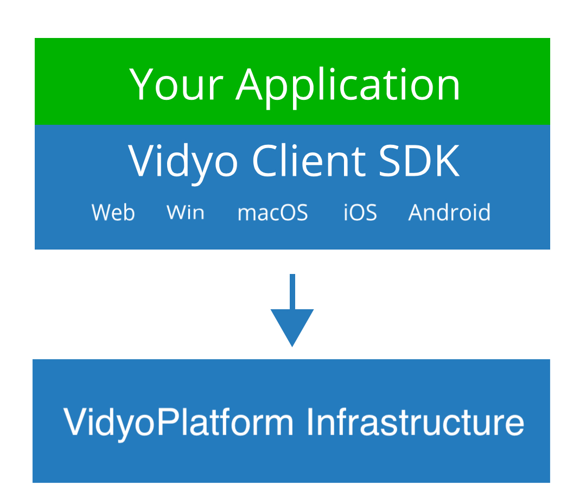

<!--- reference links -->
[keyConcepts]:           #KeyConcepts           "Key Concepts"
[gettingStarted1]:       #GettingStarted1       "Getting Started"
[gettingStarted2]:       #GettingStarted2       "Getting Started"
[initializing]:          #Initializing          "Initializing"
[rooms]:                 #Rooms                 "Rooms"
[portals]:               #Portals               "Portals"
[supportedPlatforms]:    #SupportedPlatforms    "Supported Platforms"
[vidyoConnector]:        #VidyoConnector        "VidyoConnector"
[quickStarts]:           #QuickStarts           "Quick Starts"
[webQSG]:                #JavaScriptSDK         "Web Browser Quick Start Guide"
[iOSQSG]:                #iOSSDK                "iOS Quick Start Guide"
[androidQSG]:            #AndroidSDK            "Android Quick Start Guide"
[windowsQSG]:            #WindowsSDK            "Windows Quick Start Guide"
[macOSQSG]:              #MacOSSDK              "macOS Quick Start Guide"

[macOSSDK]:   https://static.vidyo.io/latest/package/VidyoClient-OSXSDK.zip     "macOS SDK"
[windowsSDK]: https://static.vidyo.io/latest/package/VidyoClient-WindowsSDK.zip "Windows SDK"
[winVS2017SDK]: https://static.vidyo.io/latest/package/VidyoClient-WinVS2017SDK.zip "Windows Visual Studio 2017 SDK"
[webSDK]:     https://static.vidyo.io/latest/package/VidyoClient-WebSDK.zip     "Web SDK"
[iOSSDK]:     https://static.vidyo.io/latest/package/VidyoClient-iOSSDK.zip     "iOS SDK"
[androidSDK]: https://static.vidyo.io/latest/package/VidyoClient-AndroidSDK.zip "Android SDK"

[macOSPluginInstaller]:        https://static.vidyo.io/latest/bin/macos/VidyoClientPluginInstaller.pkg         "macOS Plugin Installer"
[windowsPluginInstaller32bit]: https://static.vidyo.io/latest/bin/windows/Win32/VidyoClientPluginInstaller.exe "Windows Plugin Installer 32bit"
[windowsPluginInstaller64bit]: https://static.vidyo.io/latest/bin/windows/x64/VidyoClientPluginInstaller.exe   "Windows Plugin Installer 64bit"

[macOSAppInstaller]:        https://static.vidyo.io/latest/bin/macos/VidyoConnectorAppInstaller.pkg         "macOS VidyoConnector Installer"
[windowsAppInstaller32bit]: https://static.vidyo.io/latest/bin/windows/Win32/VidyoConnectorAppInstaller.exe "Windows 32bit VidyoConnector Installer"
[windowsAppInstaller64bit]: https://static.vidyo.io/latest/bin/windows/x64/VidyoConnectorAppInstaller.exe   "Windows 64bit VidyoConnector Installer"

<!--- Overview -->

<a class="headerAnchor" name="Introduction"></a>
# Introduction

The VidyoPlatform enables developers to provide custom, high-quality, real-time video communication capabilities to their application.  The VidyoPlatform includes the VidyoClient SDK, which provides the APIs for integrating such communication capabilities into a variety of applications and workflows. It also includes the VidyoPlatform Server API for call control and moderation.

Some of the features of the VidyoPlatform include:

* Multi-party audio and video conferencing
* Group chat
* Application sharing
* Video recording
* Interoperability with 3rd party SIP systems

The VidyoClient SDK offers the same APIs on all supported platforms, providing a fast learning curve and enabling rapid development on all device types.

To learn more about how to get the most out of the VidyoPlatform, we invite you to review the [Key Concepts][keyConcepts] of our platform.

---

<a class="headerAnchor" name="SupportedPlatforms"></a>
## Supported Platforms

The VidyoClient SDK, along with the VidyoConnector reference app, run on the following platforms:

|                       | Web Browser                     | Windows                                               | macOS             | iOS             | Android               | Xamarin                              | Electron                                 |
| ---                   | ---                             | ---                                                   | ---               | ---             | ---                   | ---                                  | ---                                      |
| **Version**           | See [Quick Start Guide][webQSG] | 7+                                                    | 10.11+            | 10+             | 5.1+                  | N/A                                  | N/A                                      |
| **Languages**         | JavaScript                      | C, C#                                                 | Objective-C       | Objective-C     | Java                  | C#                                   | Javascript                               |
| **IDE**               | JavaScript editor               | Microsoft Visual Studio 2013/2017                     | Apple Xcode       | Apple Xcode     | Google Android Studio | Microsoft Visual Studio 2017         | JavaScript editor                        |
| **SDK Download**      | [Link][webSDK]                  | [2013 Link][windowsSDK] / [2017 Link][winVS2017SDK]   | [Link][macOSSDK]  | [Link][iOSSDK]  | [Link][androidSDK]    |[iOS][iOSSDK] / [Android][androidSDK] | [Win][winVS2017SDK] / [macOS][macOSSDK]  |
| **Quick Start Guide** | [Link][webQSG]                  | [Link][windowsQSG]                                    | [Link][macOSQSG]  | [Link][iOSQSG]  | [Link][androidQSG]    |[Link][xamarinQSG]                    | [Link][electronQSG]                      |

---
<a class="headerAnchor" name="GettingStarted1"></a>
## Getting Started

To start enjoying the VidyoPlatform, your main objective is to write your client application and integrate it with your business flow.

Here's the easiest way to understand the VidyoPlatform and get started with using it:

1. Launch the [demo app][gettingStarted2], and tinker with it.
2. Pick your platform of choice and follow the Quick Start Guide in the [Supported Platforms][supportedPlatforms] section above.

To dig deeper into the VidyoPlatform, we suggest you check out its [Key Concepts][keyConcepts].

---

<a class="headerAnchor" name="Help"></a>
## Need Help?

We are here to make sure you get the best video experience your customers can ever wish for. Just email us at <a href="mailto:support@vidyo.com" target="_top">support@vidyo.com</a>.

---

<!--- KeyConcepts -->

<a class="headerAnchor" name="KeyConcepts"></a>
# Key Concepts

The VidyoPlatform comprises a high-quality video infrastructure which can be delivered via cloud or on-premises deployment. The infrastructure is coupled with a VidyoClient SDK. The VidyoClient SDK offers the same APIs on all supported platforms, offering a fast learning curve and enabling rapid development on all device types.

When developing your application, you integrate the VidyoClient SDK with your application on any of the platforms necessary. Connecting to the VidyoPlatform is done by passing room credentials of a particular tenant from your application through the VidyoClient SDK to the VidyoPlatform infrastructure.



The illustration above details the components you will be interacting with when using the VidyoPlatform:

1. **VidyoPlatform Infrastructure** - This is the backend service that the VidyoClient SDK and ultimately your own application interacts with. It enables support for multiparty conferences, smart routing of video, resource allocation and management, and many other functions.
1. **VidyoClient SDK** - This is the client-side SDK that your application calls when it needs to add video support. The VidyoClient SDK shares the same APIs across the multiple [platforms][supportedPlatforms].
1. **Your Application** - This is the application that you are developing. It has a lot to do with your own service and a bit to do with video communications, which is where it interacts with the VidyoClient SDK. To make it simpler, we've created a reference application that you can use as a starting point for your own app.

The rest of this document will cover some important concepts that you need to understand in order to make the best use of the Vidyolatform.

---

<a class="headerAnchor" name="VidyoClient"></a>
## The VidyoClient

There are two important concepts in the VidyoPlatform that you need to understand:

1. Portal
2. Room

To make things simple, **portals** identify the top level domain that a user connects and **rooms** are meeting points for your users beneath a particular portal. A room can either be provisioned ahead of time or may be created by your application ad hoc via the VidyoPlatform Server API.

Check out more about [portals][portals] and [rooms][rooms].

<a class="headerAnchor" name="Initializing"></a>
### Initializing

When using the client library, the first step is to initialize the VidyoConnector

<ul class="nav nav-tabs">
  <li class="active"><a data-toggle="tab" href="#InitializingJavaScript">JavaScript</a></li>
  <li><a data-toggle="tab" href="#InitializingC"          name="#InitializingC">C</a></li>
  <li><a data-toggle="tab" href="#InitializingObjectiveC" name="#InitializingObjectiveC">Objective-C</a></li>
  <li><a data-toggle="tab" href="#InitializingJava"       name="#InitializingJava">Java</a></li>
  <li><a data-toggle="tab" href="#InitializingCSharp"     name="#InitializingCSharp">C#</a></li>
</ul>

<div class="tab-content">
<div id="InitializingJavaScript" class="tab-pane in active">

```javascript
/* JavaScript Example: */
/* Load the VidyoClient.js script and pass the onVidyoClientLoaded callback as an onload parameter */

<script src="https://static.vidyo.io/latest/javascript/VidyoClient/VidyoClient.js?onload=onVidyoClientLoaded"></script>

/* When the library loads the callback will be invoked */
<script type="text/javascript">
  function onVidyoClientLoaded(status) {
    switch (status.state) {
      case "READY":    // The library is operating normally
        // After the VidyoClient/VidyoConnector is successfully initialized,
        // a global VC object will become available.
        //
        // Load the rest of the application here
        // ...
        break;
      case "RETRYING":     // The library operating is temporarily paused
        break;
      case "FAILED":       // The library operating has stopped
        break;
      case "FAILEDVERSION":// The version of the Javascript library does not match the plugin
        status.plugInVersion; // The Version of the plugin currently installed
        status.jsVersion;     // The Version of the Javascript library loaded
        break;
      case "NOTAVAILABLE": // The library is not available
        break;
    }
    status.downloadType;                       // Available download types with possible values of "MOBILE" "PLUGIN" "APP"
    status.downloadPathApp;                    // Path to the application installer for the app which could be invoked with a protocol handler
    status.downloadPathPlugIn;                 // Path to the Plugin that can be installed
    status.downloadPathWebRTCExtensionChrome;  // Path to the optional Chrome extension required for Screen Sharing in WebRTC
    status.downloadPathWebRTCExtensionFirefox; // Path to the optional Firefox extension required for Screen Sharing in WebRTC

    return true; // Return true to reload the plugins if not available
  }
</script>
```

</div>
<div id="InitializingC" class="tab-pane">

```c
/* C Example: */
#include <Lmi/VidyoClient/VidyoConnector.h>

/* Initialize VidyoConnector */
VidyoConnectorInitialize();
```

</div>
<div id="InitializingObjectiveC" class="tab-pane">

```objc
/* Objective-C Example: */
#import <Lmi/VidyoClient/VidyoConnector_Objc.h>

/* Initialize VidyoConnector */
[VCConnectorPkg vcInitialize];
```

</div>
<div id="InitializingJava" class="tab-pane">

```java
/* Java Example: */
import com.vidyo.VidyoClient.Connector.ConnectorPkg;
import com.vidyo.VidyoClient.Connector.Connector;

/* Initialize VidyoConnector */
ConnectorPkg.setApplicationUIContext(this);
ConnectorPkg.initialize();
```

</div>
<div id="InitializingCSharp" class="tab-pane">

```csharp
/* C# Example: */
using VidyoClient;

/* Initialize VidyoConnector */
#if __ANDROID__
    ConnectorPKG.SetApplicationUIContext(context); // Needed for a Xamarin Android app
#endif
ConnectorPKG.Initialize();
```

</div>
</div>

<a class="headerAnchor" name="Connecting"></a>
### Connecting to VidyoPlatform

VidyoConnector is a very simple API that only requires two steps:

1. **Construct** and pass the window where the preview and participants should be rendered.
2. **Connect** to the live conference. A developer can specify the portal and room where they want all the live participants to connect.

<ul class="nav nav-tabs">
  <li class="active"><a data-toggle="tab" href="#ConnectingJavaScript">JavaScript</a></li>
  <li><a data-toggle="tab" href="#ConnectingC">C</a></li>
  <li><a data-toggle="tab" href="#ConnectingObjectiveC">Objective-C</a></li>
  <li><a data-toggle="tab" href="#ConnectingJava">Java</a></li>
  <li><a data-toggle="tab" href="#ConnectingCSharp">C#</a></li>
</ul>

<div class="tab-content">
<div id="ConnectingJavaScript" class="tab-pane in active">

```javascript
/* JavaScript Example: */
/* Assume that the DOM has a div with id="renderer" where the preview and the live conference should be rendered */
/* After the VidyoClient is successfully initialized a global VC object will become available  */

VC.CreateVidyoConnector({
  viewId: "renderer",                            // Div ID where the composited video will be rendered, see VidyoConnector.html
  viewStyle: "VIDYO_CONNECTORVIEWSTYLE_Default", // Visual style of the composited renderer
  remoteParticipants: 15,                        // Maximum number of participants
  logFileFilter: "warning all@VidyoConnector info@VidyoClient",
  logFileName:"",
  userData:""
}).then(function(vidyoConnector) {
   vidyoConnector.ConnectToRoomAsGuest({
     host: "some.portal.com", // designated cloud or on-premises portal of customer
     displayName: "John Smith",     
     roomKey: "JohnSmithRoomKey",
     roomPin: "JohnSmithRoomPin",

     // Define handlers for connection events.
     onSuccess: function()            {/* Connected */},
     onFailure: function(reason)      {/* Failed */},
     onDisconnected: function(reason) {/* Disconnected */}
    }).then(function(status) {
        if (status) {
            console.log("ConnectCall Success");
        } else {
            console.error("ConnectCall Failed");
        }
    }).catch(function() {
        console.error("ConnectCall Failed");
    });
}).catch(function() {
  console.error("CreateVidyoConnector Failed");
});

```

</div>
<div id="ConnectingC" class="tab-pane">

```c
/* C Example: */

/* Pass in the view, dimensions and the position within the view where the conference should be rendered */
void ConnectToRoom(LmiViewId* viewId, LmiInt x, LmiInt y, LmiUint width, LmiUint height,
                       const char* portal, const char* displayName, const char *roomKey, const char* roomPin)
{
  VidyoConnector c;
  LmiUint remoteParticipants = 15; /* Maximum number of remote participants to show */

  VidyoConnectorConstruct(&c, &viewId, VIDYO_CONNECTORVIEWSTYLE_Default, remoteParticipants,
      "warning info@VidyoConnector info@VidyoClient", NULL, NULL);
  VidyoConnectorShowViewAt(&c, &viewId, x, y, width, height);
  VidyoConnectorConnectToRoomAsGuest(&c, portal, displayName, roomKey, roomPin,
      OnSuccess, OnFailure, OnDisconnected);
}

void OnSuccess(VidyoConnector* c)                                             { /* Connected */    }
void OnFailure(VidyoConnector* c, VidyoConnectorFailReason reason)            { /* Failed */       }
void OnDisconnected(VidyoConnector* c, VidyoConnectorDisconnectReason reason) { /* Disconnected */ }
```

</div>
<div id="ConnectingObjectiveC" class="tab-pane">

```objc
/* Objective-C Example: */

/* Pass in the view, dimensions and the position within the view where the conference should be rendered */
-(void)ConnectToRoom:(void*)viewId X:(int)x Y:(int)y Width:(unsigned int)width Height:(unsigned int)height
                       Host:(const char*)portal DisplayName:(const char*)displayName
                       RoomKey:(const char*)roomKey RoomPin:(const char*)roomPin
{
  Connector *c;
  unsigned int remoteParticipants = 15; /* Maximum number of remote participants to show */

  c = [[Connector alloc] init:(void*)&videoView
                          VCConnectorViewStyle:VCConnectorViewStyleDefault
                          RemoteParticipants:remoteParticipants
                          LogFileFilter:"info@VidyoClient info@VidyoConnector warning"
                          LogFileName:""
                          UserData:0];
  [c showViewAt:&videoView X:x Y:y Width:width Height:height];
  [c connectToRoomAsGuest:portal
     DisplayName:displayName
     RoomKey:roomKey
     RoomPin:roomPin
     Connect:self];
}

/* Implementation of the IConnect interface, which are callbacks */
/* that notify the status of the Connect call.                   */
-(void) onSuccess                                          { /* Connected */ }
-(void) onFailure:(VCConnectorFailReason)reason            { /* Failed */ }
-(void) onDisconnected:(VCConnectorDisconnectReason)reason { /* Disconnected */}
```

</div>
<div id="ConnectingJava" class="tab-pane">

```java
/* Java Example: */

public class MainActivity extends Activity implements VidyoConnector.IConnect
{
    private Connector mVidyoConnector = null;
    private int remoteParticipants = 15;

    private void ConnectToRoom(FrameLayout viewId, String portal, String displayName, String roomKey, String roomPin) {
        mVidyoConnector = new Connector(viewId, Connector.ConnectorViewStyle.VIDYO_CONNECTORVIEWSTYLE_Default, remoteParticipants, "warning all@VidyoConnector info@VidyoClient", "", 0);
        mVidyoConnector.ShowViewAt(viewId, 0, 0, viewId.getWidth(), viewId.getHeight());
        mVidyoConnector.ConnectToRoomAsGuest(portal, displayName, roomKey, roomPin, this);
    }

    /*
     *  Connector Events
     */

    // Connected
    public void onSuccess() {}

    // Failed
    public void onFailure(Connector.ConnectorFailReason reason) {}

    // Disconnected
    public void onDisconnected(Connector.ConnectorDisconnectReason reason) {}
}
```

</div>
<div id="ConnectingCSharp" class="tab-pane">

```csharp
/* C# Example: */

public class MyClass : Connector.IConnect
{
    private Connector _vidyoConnector = null;
    private int _remoteParticipants = 15;

    private void ConnectToRoom(IntPtr viewHandle, uint viewWidth, uint viewHeight, string portal, string displayName, string roomKey, string roomPin) {
        _vidyoConnector = new Connector(viewHandle, Connector.ConnectorViewStyle.ConnectorviewstyleDefault, remoteParticipants, "warning all@VidyoConnector info@VidyoClient", "", 0);
        _vidyoConnector.ShowViewAt(viewHandle, 0, 0, viewWidth, viewHeight);
        _vidyoConnector.ConnectToRoomAsGuest(portal, displayName, roomKey, roomPin, this);
    }

    /*
     *  Connector Events
     */

    // Connected
    public void OnSuccess() {}

    // Failed
    public void OnFailure(Connector.ConnectorFailReason reason) {}

    // Disconnected
    public void OnDisconnected(Connector.ConnectorDisconnectReason reason) {}
}
```

</div>
</div>

---

<a class="headerAnchor" name="Portals"></a>
## Portals

TODO

---

<a class="headerAnchor" name="Rooms"></a>
## Rooms

In the VidyoPlatform, rooms are virtual meeting points in your application, that can either be created in advance (TODO: maybe add some description how here) or created ad-hoc via the VidyoPlatform Server API.

A room operates in the VidyoPlatform as a collection of users joining in a video session together. These users are referred to as participants. You can get notified on participant updates or send and receive messages with participants connected to the same room.

<a class="headerAnchor" name="Participants"></a>
### Participants

VidyoParticipant represents each user that is connected to the same room (that is, connected to the same video conference/session). Once you are connected, **RegisterParticipantEventListener** can be triggered to receive notifications upon participant updates.

<ul class="nav nav-tabs">
  <li class="active"><a data-toggle="tab" href="#ParticipantsJavaScript">JavaScript</a></li>
  <li><a data-toggle="tab" href="#ParticipantsC">C</a></li>
  <li><a data-toggle="tab" href="#ParticipantsObjectiveC">Objective-C</a></li>
  <li><a data-toggle="tab" href="#ParticipantsJava">Java</a></li>
  <li><a data-toggle="tab" href="#ParticipantsCSharp">C#</a></li>
</ul>

<div class="tab-content">
<div id="ParticipantsJavaScript" class="tab-pane in active">

```javascript
/* JavaScript Example: */

vidyoConnector.RegisterParticipantEventListener(
{
  onJoined: function(participant) { /* Participant Joined */ },
  onLeft: function(participant)   { /* Participant Left */ },
  onDynamicChanged: function(participants) { /* Ordered array of participants according to rank */ },
  onLoudestChanged: function(participant, audioOnly) { /* Current loudest speaker */ }
}).then(function() {
  console.log("RegisterParticipantEventListener Success");
}).catch(function() {
  console.err("RegisterParticipantEventListener Failed");
});
```

</div>
<div id="ParticipantsC" class="tab-pane">

```c
/* C Example: */

/* Register for Participant callbacks */
VidyoConnectorRegisterParticipantEventListener(&c, OnParticipantJoined,
   OnParticipantLeft, OnDynamicParticipantChanged, OnLoudestParticipantChanged);

void OnParticipantJoined(VidyoConnector* c, VidyoParticipant* participant)
{ /* Participant Joined */ }

void OnParticipantLeft(VidyoConnector* c, VidyoParticipant* participant)
{ /* Participant Left */ }

void OnDynamicParticipantChanged(VidyoConnector* c, LmiVector(VidyoParticipant)* participants)
{ /* Ordered array of participants according to rank */ }

void OnLoudestParticipantChanged(VidyoConnector* c, const VidyoParticipant* participant, LmiBool audioOnly)
{ /* Current loudest speaker */ }
```

</div>
<div id="ParticipantsObjectiveC" class="tab-pane">

```objc
/* Objective-C Example: */

/* Register for Participant callbacks */
[c registerParticipantEventListener:self];

/* Implementation of the VCIRegisterParticipantEventListener interface */

-(void) onParticipantJoined:(VCParticipant*)participant
{ /* Participant Joined */ }

-(void) onParticipantLeft:(VCParticipant*)participant
{ /* Participant Left */ }

-(void) onDynamicParticipantChanged:(NSMutableArray*)participants
{ /* Ordered array of participants according to rank */ }

-(void) onLoudestParticipantChanged:(VCParticipant*)participant AudioOnly:(BOOL)audioOnly
{ /* Current loudest speaker */ }
```

</div>
<div id="ParticipantsJava" class="tab-pane">

```java
/* Java Example: */

public class MainActivity extends Activity implements VidyoConnector.IRegisterParticipantEventListener
{
    // Register for VidyoConnector event listeners. Note: this is an arbitrary function name.
    public void RegisterForVidyoEvents() {
        // Register for Participant callbacks
        mVidyoConnector.registerParticipantEventListener(this);
    }

    // Participant Joined
    public void onParticipantJoined(Participant participant) {}

    // Participant Left
    public void void onParticipantLeft(Participant participant) {}

    // Ordered array of participants according to rank
    public void onDynamicParticipantChanged(ArrayList participants) {}

    // Current loudest speaker
    public void onLoudestParticipantChanged(Participant participant, boolean audioOnly) {}
}
```

</div>
<div id="ParticipantsCSharp" class="tab-pane">

```csharp
/* C# Example: */

public class MyClass : Connector.IRegisterParticipantEventListener
{
    // Register for VidyoConnector event listeners. Note: this is an arbitrary function name.
    public void RegisterForVidyoEvents() {
        // Register for Participant callbacks
        _vidyoConnector.RegisterParticipantEventListener(this);
    }

    // Participant Joined
    public void OnParticipantJoined(Participant participant) {}

    // Participant Left
    public void void OnParticipantLeft(Participant participant) {}

    // Ordered array of participants according to rank
    public void OnDynamicParticipantChanged(List<Participant> participants) {}

    // Current loudest speaker
    public void OnLoudestParticipantChanged(Participant participant, bool audioOnly) {}
}
```

</div>
</div>

<a class="headerAnchor" name="GroupChat"></a>
### Group Chat

The VidyoPlatform supports message sending to all participants that are connected to the same room.

<ul class="nav nav-tabs">
  <li class="active"><a data-toggle="tab" href="#GroupChatJavaScript">JavaScript</a></li>
  <li><a data-toggle="tab" href="#GroupChatC">C</a></li>
  <li><a data-toggle="tab" href="#GroupChatObjectiveC">Objective-C</a></li>
  <li><a data-toggle="tab" href="#GroupChatJava">Java</a></li>
  <li><a data-toggle="tab" href="#GroupChatCSharp">C#</a></li>
</ul>

<div class="tab-content">
<div id="GroupChatJavaScript" class="tab-pane in active">

```javascript
/* JavaScript Example: */

/* Register to receive chat messages */
vidyoConnector.RegisterMessageEventListener({
  onChatMessageReceived: function(participant, chatMessage) { /* Message received from other participant */ }
}).then(function() {
  console.log("RegisterMessageEventListener Success");
}).catch(function() {
  console.err("RegisterMessageEventListener Failed");
});

/* Send chat message */
vidyoConnector.SendChatMessage({message:"Hello"});
```

</div>
<div id="GroupChatC" class="tab-pane">

```c
/* C Example: */

/* Register to receive chat messages */
VidyoConnectorRegisterMessageEventListener(&c, OnChatMessageReceived);

/* Chat message received */
void OnChatMessageReceived(VidyoConnector* c, VidyoParticipant* participant, VidyoChatMessage* chatMessage)
{ /* Message received from other participants */ }

/* Send chat message */
VidyoConnectorSendChatMessage(&c, "Hello");
```

</div>
<div id="GroupChatObjectiveC" class="tab-pane">

```objc
/* Objective-C Example: */

/* Register to receive chat messages */
[c registerMessageEventListener:self];

/* Implementation of the VCIRegisterMessageEventListener interface */
/* Chat message received */
-(void) onChatMessageReceived:(VCParticipant*)participant ChatMessage:(VCChatMessage*)chatMessage;
{ /* Message received from other participants */ }

/* Send chat message */
[c sendChatMessage:"Hello"];
```

</div>
<div id="GroupChatJava" class="tab-pane">

```java
/* Java Example: */

public class MainActivity extends Activity implements VidyoConnector.IRegisterMessageEventListener
{
    // Register for VidyoConnector event listeners. Note: this is an arbitrary function name.
    public void RegisterForVidyoEvents() {
        // Register to receive chat messages
        mVidyoConnector.registerMessageEventListener(this);
    }

    private void SendChatMessage(String message) {
        mVidyoConnector.sendChatMessage(message);
    }

    // Message received from other participants
    public void onChatMessageReceived(Participant participant, ChatMessage chatMessage) {}
}
```

</div>
<div id="GroupChatCSharp" class="tab-pane">

```csharp
/* C# Example: */

public class MyClass : Connector.IRegisterMessageEventListener
{
    // Register for VidyoConnector event listeners. Note: this is an arbitrary function name.
    public void RegisterForVidyoEvents() {
        // Register to receive chat messages
        _vidyoConnector.RegisterMessageEventListener(this);
    }

    private void SendChatMessage(string message) {
        _vidyoConnector.SendChatMessage(message);
    }

    // Message received from other participants
    public void OnChatMessageReceived(Participant participant, ChatMessage chatMessage) {}
}
```

</div>
</div>

---

<a class="headerAnchor" name="DeviceManagement"></a>
## Device Management

The VidyoConnector will pick the default camera, microphone, and speaker. However, you can override this by using one of two ways of manipulating devices: cycling and selecting. Note that on native mobile platforms, only camera management is supported, whereas routing of audio input/output is managed by the OS.

### Cycling
The VidyoClient SDK allows the user to cycle the camera/microphone/speaker until the right one is found. This is similar to how you switch between front and back cameras in your smartphone's built-in camera app. This allows for an easy-to-use UI where the user can attempt the various combinations until reaching the one desired.

<ul class="nav nav-tabs">
  <li class="active"><a data-toggle="tab" href="#DeviceManagementJavaScript">JavaScript</a></li>
  <li><a data-toggle="tab" href="#DeviceManagementC">C</a></li>
  <li><a data-toggle="tab" href="#DeviceManagementObjectiveC">Objective-C</a></li>
  <li><a data-toggle="tab" href="#DeviceManagementJava">Java</a></li>
  <li><a data-toggle="tab" href="#DeviceManagementCSharp">C#</a></li>
</ul>

<div class="tab-content">
<div id="DeviceManagementJavaScript" class="tab-pane in active">

```javascript
/* JavaScript Example: */

vidyoConnector.CycleCamera();
vidyoConnector.CycleMicrophone();
vidyoConnector.CycleSpeaker();
```

</div>
<div id="DeviceManagementC" class="tab-pane">

```c
/* C Example: */

VidyoConnectorCycleCamera();
VidyoConnectorCycleMicrophone();
VidyoConnectorCycleSpeaker();
```

</div>
<div id="DeviceManagementObjectiveC" class="tab-pane">

```objc
/* Objective-C Example: */

[c cycleCamera];
[c cycleMicrophone];
[c cycleSpeaker];
```

</div>
<div id="DeviceManagementJava" class="tab-pane">

```java
/* Java Example: */

mVidyoConnector.cycleCamera();
mVidyoConnector.cycleMicrophone();
mVidyoConnector.cycleSpeaker();
```

</div>
<div id="DeviceManagementCSharp" class="tab-pane">

```csharp
/* C# Example: */

_vidyoConnector.CycleCamera();
_vidyoConnector.CycleMicrophone();
_vidyoConnector.CycleSpeaker();
```

</div>
</div>

### Selecting
Another means for a user to manage their devices is to directly select the camera, microphone, or speaker of their choosing. To get notified which devices are available and select a device by name, you can use the **RegisterLocalCameraEventListener / RegisterLocalMicrophoneEventListener / RegisterLocalSpeakerEventListener** and **SelectCamera / SelectMicrophone / SelectSpeaker** APIs.

<ul class="nav nav-tabs">
  <li class="active"><a data-toggle="tab" href="#SelectingDevicesJavaScript">JavaScript</a></li>
  <li><a data-toggle="tab" href="#SelectingDevicesC">C</a></li>
  <li><a data-toggle="tab" href="#SelectingDevicesObjectiveC">Objective-C</a></li>
  <li><a data-toggle="tab" href="#SelectingDevicesJava">Java</a></li>
  <li><a data-toggle="tab" href="#SelectingDevicesCSharp">C#</a></li>
</ul>

<div class="tab-content">
<div id="SelectingDevicesJavaScript" class="tab-pane in active">

```javascript
/* JavaScript Example: */

/* Camera event listener */
vidyoConnector.RegisterLocalCameraEventListener({
  onAdded: function(localCamera) { /* New camera is available */
    if (/* This is the camera that is desired */) {
        vidyoConnector.SelectLocalCamera({localCamera:localCamera});
    }
  },
  onRemoved:  function(localCamera) { /* Existing camera became unavailable */ },
  onSelected: function(localCamera) { /* Camera was selected by user or automatically */ },
  onStateUpdated: function(localCamera, state) { /* Camera state was updated */ }
}).then(function() {
  console.log("RegisterLocalCameraEventListener Success");
}).catch(function() {
  console.error("RegisterLocalCameraEventListener Failed");
});

/* Microphone event listener */
vidyoConnector.RegisterLocalMicrophoneEventListener({
  onAdded: function(localMicrophone) { /* New microphone is available */
    if (/* This is the microphone that is desired */) {
      vidyoConnector.SelectLocalMicrophone({localMicrophone:localMicrophone});
    }
  },
  onRemoved:  function(localMicrophone) { /* Existing microphone became unavailable */ },
  onSelected: function(localMicrophone) { /* Microphone was selected by user or automatically */ },
  onStateUpdated: function(localMicrophone, state) { /* Microphone state was updated */ }
}).then(function() {
  console.log("RegisterLocalMicrophoneEventListener Success");
}).catch(function() {
  console.error("RegisterLocalMicrophoneEventListener Failed");
});

/* Speaker event listener */
vidyoConnector.RegisterLocalSpeakerEventListener({
  onAdded: function(localSpeaker) { /* New speaker is available */
    if (/* This is the speaker that is desired */) {
      vidyoConnector.SelectLocalSpeaker({localSpeaker:localSpeaker});
    }
  },
  onRemoved:  function(localSpeaker) { /* Existing speaker became unavailable */ },
  onSelected: function(localSpeaker) { /* Speaker was selected by user or automatically */ },
  onStateUpdated: function(localSpeaker, state) { /* Speaker state was updated */ }
}).then(function() {
  console.log("RegisterLocalSpeakerEventListener Success");
}).catch(function() {
  console.error("RegisterLocalSpeakerEventListener Failed");
});

```

</div>
<div id="SelectingDevicesC" class="tab-pane">

```c
/* C Example: */

/* Register for camera events */
VidyoConnectorRegisterLocalCameraEventListener(&c, OnLocalCameraAdded, OnLocalCameraRemoved,
    OnLocalCameraSelected, OnLocalCameraStateUpdated);

/* Camera event listeners */
void OnLocalCameraAdded(VidyoConnector* c, VidyoLocalCamera* localCamera)
{ /* New camera is available */
    if (/* This is the camera that is desired */) {
        VidyoConnectorSelectLocalCamera(c, localCamera);
    }
}

void OnLocalCameraRemoved(VidyoConnector* c, VidyoLocalCamera* localCamera)
{ /* Existing camera became unavailable */ }

void OnLocalCameraSelected(VidyoConnector* c, VidyoLocalCamera* localCamera)
{ /* Camera was selected by user or automatically */ }

void OnLocalCameraStateUpdated(VidyoConnector* c, VidyoLocalCamera* localCamera, VidyoDeviceState state)
{ /* Camera state was updated */ }

/******************************************************************************/

/* Register for microphone events */
VidyoConnectorRegisterLocalMicrophoneEventListener(&vc, OnLocalMicrophoneAdded,
    OnLocalMicrophoneRemoved, OnLocalMicrophoneSelected, OnLocalMicrophoneStateUpdated);

/* Microphone event listeners */
void OnLocalMicrophoneAdded(VidyoConnector* c, VidyoLocalMicrophone* localMicrophone)
{ /* New microphone is available */
    if (/* This is the microphone that is desired */) {
        VidyoConnectorSelectLocalMicrophone(c, localMicrophone);
    }
}

void OnLocalMicrophoneRemoved(VidyoConnector* c, VidyoLocalMicrophone* localMicrophone)
{ /* Existing microphone became unavailable */ }

void OnLocalMicrophoneSelected(VidyoConnector* c, VidyoLocalMicrophone* localMicrophone)
{ /* Microphone was selected by user or automatically */ }

void OnLocalMicrophoneStateUpdated(VidyoConnector* c, VidyoLocalMicrophone* localMicrophone, VidyoDeviceState state)
{ /* Microphone state was updated */ }

/******************************************************************************/

/* Register for speaker events */
VidyoConnectorRegisterLocalSpeakerEventListener(&vc, OnLocalSpeakerAdded,
    OnLocalSpeakerRemoved, OnLocalSpeakerSelected, OnLocalSpeakerStateUpdated);

/* Speaker event listeners */
void OnLocalSpeakerAdded(VidyoConnector* c, VidyoLocalSpeaker* localSpeaker)
{ /* New speaker is available */
    if (/* This is the speaker that is desired */) {
        VidyoConnectorSelectLocalSpeaker(c, localSpeaker);
    }
}

void OnLocalSpeakerRemoved(VidyoConnector* c, VidyoLocalSpeaker* localSpeaker)
{ /* Existing speaker became unavailable */ }

void OnLocalSpeakerSelected(VidyoConnector* c, VidyoLocalSpeaker* localSpeaker)
{ /* Speaker was selected by user or automatically */ }

void OnLocalSpeakerStateUpdated(VidyoConnector* c, VidyoLocalSpeaker* localSpeaker, VidyoDeviceState state)
{ /* Speaker state was updated */ }
```

</div>
<div id="SelectingDevicesObjectiveC" class="tab-pane">

```objc
/* Objective-C Example: */

/* Register for camera events */
[c registerLocalCameraEventListener:self];

/* Implementation of the VCIRegisterLocalCameraEventListener interface (camera event listeners) */

-(void) onLocalCameraAdded:(VCLocalCamera*)localCamera {
  /* New camera is available */
  if (/* This is the camera that is desired */) {
      [c selectLocalCamera:localCamera];
  }
}

-(void) onLocalCameraRemoved:(VCLocalCamera*)localCamera
{ /* Existing camera became unavailable */ }

-(void) onLocalCameraSelected:(VCLocalCamera*)localCamera
{ /* Camera was selected by user or automatically */ }

-(void) onLocalCameraStateUpdated:(VCLocalCamera*)localCamera State:(VCDeviceState)state;
{ /* Camera state was updated */ }

/******************************************************************************/

/* Register for microphone events */
[c registerLocalMicrophoneEventListener:self];

/* Implementation of the VCIRegisterLocalMicrophoneEventListener interface (microphone event listeners) */

-(void) onLocalMicrophoneAdded:(VCLocalMicrophone*)localMicrophone {
  /* New microphone is available */
  if (/* This is the microphone that is desired */) {
      [c selectLocalMicrophone:localMicrophone];
  }
}

-(void) onLocalMicrophoneRemoved:(VCLocalMicrophone*)localMicrophone
{ /* Existing microphone became unavailable */ }

-(void) onLocalMicrophoneSelected:(VCLocalMicrophone*)localMicrophone
{ /* Microphone was selected by user or automatically */ }

-(void) onLocalMicrophoneStateUpdated:(VCLocalMicrophone*)localMicrophone State:(VCDeviceState)state;
{ /* Microphone state was updated */ }

/******************************************************************************/

/* Register for speaker events */
[c registerLocalSpeakerEventListener:self];

/* Implementation of the VCIRegisterLocalSpeakerEventListener interface (speaker event listeners) */

-(void) onLocalSpeakerAdded:(VCLocalSpeaker*)localSpeaker {
  /* New speaker is available */
  if (/* This is the speaker that is desired */) {
      [c selectLocalSpeaker:localSpeaker];
  }
}

-(void) onLocalSpeakerRemoved:(VCLocalSpeaker*)localSpeaker
{ /* Existing speaker became unavailable */ }

-(void) onLocalSpeakerSelected:(VCLocalSpeaker*)localSpeaker
{ /* Speaker was selected by user or automatically */ }

-(void) onLocalSpeakerStateUpdated:(VCLocalSpeaker*)localSpeaker State:(VCDeviceState)state;
{ /* Speaker state was updated */ }

```

</div>
<div id="SelectingDevicesJava" class="tab-pane">

```java
/* Java Example: */

import com.vidyo.VidyoClient.Connector.ConnectorPkg;
import com.vidyo.VidyoClient.Connector.Connector;

public class MainActivity extends Activity implements VidyoConnector.IRegisterLocalCameraEventListener, VidyoConnector.IRegisterLocalMicrophoneEventListener, VidyoConnector.IRegisterLocalSpeakerEventListener
{
    /* Register for VidyoConnector event listeners. Note: this is an arbitrary function name. */
    public void RegisterForVidyoEvents() {
        /* Register for camera, microphone, and speaker events */
        mVidyoConnector.registerLocalCameraEventListener(this);
        mVidyoConnector.registerLocalMicrophoneEventListener(this);
        mVidyoConnector.registerLocalSpeakerEventListener(this);
    }

    /* Camera event listener */
    public void onLocalCameraAdded(LocalCamera localCamera)    { /* New camera is available */
        if (/* This is the camera that is desired */) {
            mVidyoConnector.selectLocalCamera(localCamera);
        }
    }
    public void onLocalCameraRemoved(LocalCamera localCamera)  { /* Existing camera became unavailable */          }
    public void onLocalCameraSelected(LocalCamera localCamera) { /* Camera was selected by user or automatically */ }
    public void onLocalCameraStateUpdated(LocalCamera localCamera, DeviceState state) { /* Camera state was updated */ }

    /* Microphone event listener */
    public void onLocalMicrophoneAdded(LocalMicrophone localMicrophone)    { /* New microphone is available */
        if (/* This is the microphone that is desired */) {
            mVidyoConnector.selectLocalMicrophone(localMicrophone);
        }
    }
    public void onLocalMicrophoneRemoved(LocalMicrophone localMicrophone)  { /* Existing microphone became unavailable */          }
    public void onLocalMicrophoneSelected(LocalMicrophone localMicrophone) { /* Microphone was selected by user or automatically */ }
    public void onLocalMicrophoneStateUpdated(LocalMicrophone localMicrophone, DeviceState state) { /* Microphone state was updated */ }

    /* Speaker event listener */
    public void onLocalSpeakerAdded(LocalSpeaker localSpeaker)    { /* New speaker is available */
        if (/* This is the speaker that is desired */) {
            mVidyoConnector.selectLocalSpeaker(localSpeaker);
        }
    }
    public void onLocalSpeakerRemoved(LocalSpeaker localSpeaker)  { /* Existing speaker became unavailable */          }
    public void onLocalSpeakerSelected(LocalSpeaker localSpeaker) { /* Speaker was selected by user or automatically */ }
    public void onLocalSpeakerStateUpdated(LocalSpeaker localSpeaker, DeviceState state) { /* Speaker state was updated */ }
}
```

</div>
<div id="SelectingDevicesCSharp" class="tab-pane">

```csharp
/* C# Example: */

using VidyoClient;

public class MyClass : Connector.IRegisterLocalCameraEventListener, Connector.IRegisterLocalMicrophoneEventListener, Connector.IRegisterLocalSpeakerEventListener
{
    /* Register for VidyoConnector event listeners. Note: this is an arbitrary function name. */
    public void RegisterForVidyoEvents() {
        /* Register for camera, microphone, and speaker events */
        _vidyoConnector.RegisterLocalCameraEventListener(this);
        _vidyoConnector.RegisterLocalMicrophoneEventListener(this);
        _vidyoConnector.RegisterLocalSpeakerEventListener(this);
    }

    /* Camera event listener */
    public void OnLocalCameraAdded(LocalCamera localCamera)    { /* New camera is available */
        if (/* This is the camera that is desired */) {
            _vidyoConnector.SelectLocalCamera(localCamera);
        }
    }
    public void OnLocalCameraRemoved(LocalCamera localCamera)  { /* Existing camera became unavailable */          }
    public void OnLocalCameraSelected(LocalCamera localCamera) { /* Camera was selected by user or automatically */ }
    public void OnLocalCameraStateUpdated(LocalCamera localCamera, Device.DeviceState state) { /* Camera state was updated */ }

    /* Microphone event listener */
    public void OnLocalMicrophoneAdded(LocalMicrophone localMicrophone)    { /* New microphone is available */
        if (/* This is the microphone that is desired */) {
            _vidyoConnector.SelectLocalMicrophone(localMicrophone);
        }
    }
    public void OnLocalMicrophoneRemoved(LocalMicrophone localMicrophone)  { /* Existing microphone became unavailable */          }
    public void OnLocalMicrophoneSelected(LocalMicrophone localMicrophone) { /* Microphone was selected by user or automatically */ }
    public void OnLocalMicrophoneStateUpdated(LocalMicrophone localMicrophone, Device.DeviceState state) { /* Microphone state was updated */ }

    /* Speaker event listener */
    public void OnLocalSpeakerAdded(LocalSpeaker localSpeaker)    { /* New speaker is available */
        if (/* This is the speaker that is desired */) {
            _vidyoConnector.SelectLocalSpeaker(localSpeaker);
        }
    }
    public void OnLocalSpeakerRemoved(LocalSpeaker localSpeaker)  { /* Existing speaker became unavailable */          }
    public void OnLocalSpeakerSelected(LocalSpeaker localSpeaker) { /* Speaker was selected by user or automatically */ }
    public void OnLocalSpeakerStateUpdated(LocalSpeaker localSpeaker, Device.DeviceState state) { /* Speaker state was updated */ }
}
```

</div>
</div>

### Resetting to Default
To reset devices back to their defaults, you can use the **SelectDefaultCamera / SelectDefaultMicrophone / SelectDefaultSpeaker**  APIs.

<ul class="nav nav-tabs">
  <li class="active"><a data-toggle="tab" href="#ResettingToDefaultJavaScript">JavaScript</a></li>
  <li><a data-toggle="tab" href="#ResettingToDefaultC">C</a></li>
  <li><a data-toggle="tab" href="#ResettingToDefaultObjectiveC">Objective-C</a></li>
  <li><a data-toggle="tab" href="#ResettingToDefaultJava">Java</a></li>
  <li><a data-toggle="tab" href="#ResettingToDefaultCSharp">C#</a></li>
</ul>

<div class="tab-content">
<div id="ResettingToDefaultJavaScript" class="tab-pane in active">

```javascript
/* JavaScript Example: */

vidyoConnector.SelectDefaultCamera();
vidyoConnector.SelectDefaultMicrophone();
vidyoConnector.SelectDefaultSpeaker();
```

</div>
<div id="ResettingToDefaultC" class="tab-pane">

```c
/* C Example: */

VidyoConnectorSelectDefaultCamera();
VidyoConnectorSelectDefaultMicrophone();
VidyoConnectorSelectDefaultSpeaker();
```

</div>
<div id="ResettingToDefaultObjectiveC" class="tab-pane">

```objc
/* Objective-C Example: */

[c selectDefaultCamera];
[c selectDefaultMicrophone];
[c selectDefaultSpeaker];
```

</div>
<div id="ResettingToDefaultJava" class="tab-pane">

```java
/* Java Example: */

mVidyoConnector.selectDefaultCamera();
mVidyoConnector.selectDefaultMicrophone();
mVidyoConnector.selectDefaultSpeaker();
```

</div>
<div id="ResettingToDefaultCSharp" class="tab-pane">

```csharp
/* C# Example: */

_vidyoConnector.SelectDefaultCamera();
_vidyoConnector.SelectDefaultMicrophone();
_vidyoConnector.SelectDefaultSpeaker();
```

</div>
</div>

---

<a class="headerAnchor" name="ScreenSharing"></a>
## Screen Sharing

Windows and monitors can be shared in a session taking place in a room. Passing *null* into **SelectLocalWindowShare / SelectLocalMonitor** will stop the sharing.

>The `RegisterLocalWindowShareEventListener` should only be called when the application is ready to share and it should be unregistered after the share was selected.

In WebRTC applications using Chrome 72 or greater, an extension is no longer necessary to enable window sharing. In Chrome versions below 72, an extension is still required. It can be downloaded from the link provided in `status.downloadPathWebRTCExtensionChrome` inside the `VidyoClient.js?onload=` event. See [Initializing][initializing] section. The browser will pop up it's own share selection dialog once `RegisterLocalWindowShareEventListener` is called and the result of the user selection will be the available in the `onAdded` event.

>Screen sharing does not currently work in the mobile SDKs (iOS and Android).

<ul class="nav nav-tabs">
  <li class="active"><a data-toggle="tab" href="#SharingJavaScript">JavaScript</a></li>
  <li><a data-toggle="tab" href="#SharingC">C</a></li>
  <li><a data-toggle="tab" href="#SharingObjectiveC">Objective-C</a></li>
  <li><a data-toggle="tab" href="#SharingJava">Java</a></li>
  <li><a data-toggle="tab" href="#SharingCSharp">C#</a></li>
</ul>

<div class="tab-content">
<div id="SharingJavaScript" class="tab-pane in active">

```javascript
/* JavaScript Example: */

/* WindowShare event listener */
vidyoConnector.RegisterLocalWindowShareEventListener({
  onAdded: function(localWindowShare) { /* New window is available for sharing */
    if (/* This is the window the user wants to share */) {
      vidyoConnector.SelectLocalWindowShare({localWindowShare:localWindowShare});
    }
  },
  onRemoved:  function(localWindowShare) { /* Existing window is no longer available for sharing */ },
  onSelected: function(localWindowShare) {
    /* Window was selected */
    if (localWindowShare) {
        localWindowShare.GetPreviewFrameDataUriAsync({
            maxWidth: 300,
            maxHeight: 300,
            onComplete: function(response) {
                // Assign an image source in the UI with the preview frame
            }
        });
    } else {
        // Unassign the image source in the UI from the preview frame
    }
  }
  onStateUpdated: function(localWindowShare, state) { /* window share state has been updated */ }
}).then(function() {
  console.log("RegisterLocalWindowShareEventListener Success");
}).catch(function() {
  console.error("RegisterLocalWindowShareEventListener Failed");
});

/* Monitor event listener */
vidyoConnector.RegisterLocalMonitorEventListener({
  onAdded: function(localMonitor) { /* New monitor is available for sharing */
    if (/* This is the monitor that should be shared */) {
      vidyoConnector.SelectLocalMonitor({localMonitor:localMonitor});
    }
  },
  onRemoved:  function(localMonitor) { /* Existing monitor is no longer available for sharing */ },
  onSelected: function(localMonitor) {
    /* Monitor was selected */
    if (localMonitor) {
        localMonitor.GetPreviewFrameDataUriAsync({
            maxWidth: 300,
            maxHeight: 300,
            onComplete: function(response) {
                // Assign an image source in the UI with the preview frame
            }
        });
    } else {
        // Unassign the image source in the UI from the preview frame
    }
  }
  onStateUpdated: function(localMonitor, state) { /* Monitor state has been updated */ }
}).then(function() {
  console.log("RegisterLocalMonitorEventListener Success");
}).catch(function() {
  console.error("RegisterLocalMonitorEventListener Failed");
});
```

</div>
<div id="SharingC" class="tab-pane">

```c
/* C Example: */

/* Register for LocalWindowShare callbacks */
VidyoConnectorRegisterLocalWindowShareEventListener(&c, OnLocalWindowShareAdded,
   OnLocalWindowShareRemoved, OnLocalWindowShareSelected, OnLocalWindowShareStateUpdated);

/* WindowShare event listener */
void OnLocalWindowShareAdded(VidyoConnector* c, VidyoLocalWindowShare* localWindowShare)
{ /* New window is available */
   if (/* This is the window that should be shared */) {
      VidyoConnectorSelectLocalWindowShare(c, localWindowShare);
   }
}

void OnLocalWindowShareRemoved(VidyoConnector* c, VidyoLocalWindowShare* localWindowShare)
{ /* Existing window became unavailable */ }

void OnLocalWindowShareSelected(VidyoConnector* c, VidyoLocalWindowShare* localWindowShare)
{ /* window was selected by user or automatically */ }

void OnLocalWindowShareStateUpdated(VidyoConnector* c, VidyoLocalWindowShare* localWindowShare, VidyoDeviceState state)
{ /* window share state has been updated */ }

/******************************************************************************/

/* Register for LocalMonitor callbacks */
VidyoConnectorRegisterLocalMonitorEventListener(&vc, OnLocalMonitorAdded,
   OnLocalMonitorRemoved, OnLocalMonitorSelected, OnLocalMonitorStateUpdated);

/* Monitor event listener */
void OnLocalMonitorAdded(VidyoConnector* c, VidyoLocalMonitor* localMonitor)
{ /* New monitor is available */
   if (/* This is the monitor that should be shared */) {
      VidyoConnectorSelectLocalMonitor(c, localMonitor);
   }
}

void OnLocalMonitorRemoved(VidyoConnector* c, VidyoLocalMonitor* localMonitor)
{ /* Existing monitor became unavailable */ }

void OnLocalMonitorSelected(VidyoConnector* c, VidyoLocalMonitor* localMonitor)
{ /* monitor was selected by user or automatically */ }

void OnLocalMonitorStateUpdated(VidyoConnector* c, VidyoLocalMonitor* localMonitor, VidyoDeviceState state)
{ /* monitor state has been updated */ }
```

</div>
<div id="SharingObjectiveC" class="tab-pane">

```objc
/* Objective-C Example: */

/* Register for LocalWindowShare callbacks */
[c registerLocalWindowShareEventListener:self];

/* Implementation of the VCIRegisterLocalWindowShareEventListener interface */

-(void) onLocalWindowShareAdded:(VCLocalWindowShare*)localWindowShare
{ /* New window is available */
   if (/* This is the window that should be shared */) {
      [c selectLocalWindowShare:localWindowShare];
   }
}

-(void) onLocalWindowShareRemoved:(VCLocalWindowShare*)localWindowShare
{ /* Existing window became unavailable */ }

-(void) onLocalWindowShareSelected:(VCLocalWindowShare*)localWindowShare
{ /* window was selected by user or automatically */ }

-(void) onLocalWindowShareStateUpdated:(VCLocalWindowShare*)localWindowShare State:(VCDeviceState)state
{ /* window share state has been updated */ }

/******************************************************************************/

/* Register for LocalMonitor callbacks */
[c registerLocalMonitorEventListener:self];

/* Implementation of the VCIRegisterLocalMonitorEventListener interface */

-(void) onLocalMonitorAdded:(VCLocalMonitor*)localMonitor
{ /* New monitor is available */
   if (/* This is the monitor that should be shared */) {
      [c selectLocalMonitor:localMonitor];
   }
}

-(void) onLocalMonitorRemoved:(VCLocalMonitor*)localMonitor
{ /* Existing monitor became unavailable */ }

-(void) onLocalMonitorSelected:(VCLocalMonitor*)localMonitor
{ /* monitor was selected by user or automatically */ }

-(void) onLocalMonitorStateUpdated:(VCLocalMonitor*)localMonitor State:(VCDeviceState)state
{ /* monitor state has been updated */ }
```

</div>
<div id="SharingJava" class="tab-pane">

```java
/* Java Example: */

public class MainActivity extends Activity implements VidyoConnector.IRegisterLocalWindowShareEventListener,
      VidyoConnector.IRegisterLocalMonitorEventListener
{
    /* Register for VidyoConnector event listeners. Note: this is an arbitrary function name. */
    public void RegisterForVidyoEvents() {
        /* Register for local window share and local monitor events */
        mVidyoConnector.registerLocalWindowShareEventListener(this);
        mVidyoConnector.registerLocalMonitorEventListener(this);
    }

    /* WindowShare Event Listener */
    public void onLocalWindowShareAdded(LocalWindowShare localWindowShare) { /* New window is available for sharing */
        if (/* This is the window that should be shared */) {
            mVidyoConnector.selectLocalWindowShare(localWindowShare)
        }
    }
    public void onLocalWindowShareRemoved(LocalWindowShare localWindowShare)  { /* Existing window is no longer available for sharing */ }
    public void onLocalWindowShareSelected(LocalWindowShare localWindowShare) { /* Window was selected */ }
    public void onLocalWindowShareStateUpdated(LocalWindowShare localWindowShare, DeviceState state) {  /* window share state has been updated */ }

    /* Monitor Event Listener */
    public void onLocalMonitorAdded(LocalMonitor localMonitor)    { /* New monitor is available for sharing*/
        if (/* This is the monitor that should be shared */) {
            mVidyoConnector.selectLocalMonitor(localMonitor)
        }
    }
    public void onLocalMonitorRemoved(LocalMonitor localMonitor)  { /* Existing monitor is no longer available for sharing */ }
    public void onLocalMonitorSelected(LocalMonitor localMonitor) { /* Monitor was selected */ }
    public void onLocalMonitorStateUpdated(LocalMonitor localMonitor, DeviceState state) {  /* monitor state has been updated */ }
}
```

</div>
<div id="SharingCSharp" class="tab-pane">

```csharp
/* C# Example: */

public class MyClass : Connector.IRegisterLocalWindowShareEventListener, Connector.IRegisterLocalMonitorEventListener
{
    /* Register for VidyoConnector event listeners. Note: this is an arbitrary function name. */
    public void RegisterForVidyoEvents() {
        /* Register for local window share and local monitor events */
        _vidyoConnector.RegisterLocalWindowShareEventListener(this);
        _vidyoConnector.RegisterLocalMonitorEventListener(this);
    }

    /* WindowShare Event Listener */
    public void OnLocalWindowShareAdded(LocalWindowShare localWindowShare) { /* New window is available for sharing */
        if (/* This is the window that should be shared */) {
            _vidyoConnector.SelectLocalWindowShare(localWindowShare)
        }
    }
    public void OnLocalWindowShareRemoved(LocalWindowShare localWindowShare)  { /* Existing window is no longer available for sharing */ }
    public void OnLocalWindowShareSelected(LocalWindowShare localWindowShare) { /* Window was selected */ }
    public void OnLocalWindowShareStateUpdated(LocalWindowShare localWindowShare, Device.DeviceState state) {  /* window share state has been updated */ }

    /* Monitor Event Listener */
    public void OnLocalMonitorAdded(LocalMonitor localMonitor)    { /* New monitor is available for sharing*/
        if (/* This is the monitor that should be shared */) {
          _vidyoConnector.SelectLocalMonitor(localMonitor)
        }
    }
    public void OnLocalMonitorRemoved(LocalMonitor localMonitor)  { /* Existing monitor is no longer available for sharing */ }
    public void OnLocalMonitorSelected(LocalMonitor localMonitor) { /* Monitor was selected */ }
    public void OnLocalMonitorStateUpdated(LocalMonitor localMonitor, Device.DeviceState state) {  /* monitor state has been updated */ }
}
```

</div>
</div>

---

<a class="headerAnchor" name="Backgrounding"></a>
## Backgrounding

Handling background/foreground transitions need to be dealt with in similar, but slighly different fashions in Android and iOS. The VidyoConnectorSetMode API should be used to notify the VidyoClient of the changing state and it is up to the app itself to factor in several other considerations:

* Due to privacy concerns, iOS does not allow for the local camera to be captured while the app is backgrounded, whereas Android does. Therefore, an Android application can decide how to handle camera privacy when backgrounded.
* When the VidyoConnector is not connected to a room, the application may want to release devices (camera/microphone/speaker) when backgrounded, so other applications can access these devices if needed. If this is done, the application would have to cache the devices to reselect them when returning to the foreground.
* The iOS and Android sample VidyoConnector applications (which are packaged within their respective SDKs) highlight the above items.

<ul class="nav nav-tabs">
  <li class="active"><a data-toggle="tab" href="#BackgroundingObjectiveC">Objective-C</a></li>
  <li><a data-toggle="tab" href="#BackgroundingJava">Java</a></li>
</ul>

<div class="tab-content">
<div id="BackgroundingObjectiveC" class="tab-pane in active">

```objc
// iOS - Objective-C Example:

// Register for notifications when app is active/inactive (foreground/background)
[[NSNotificationCenter defaultCenter] addObserver:self selector:@selector(appWillResignActive:) name:UIApplicationWillResignActiveNotification object:nil];
[[NSNotificationCenter defaultCenter] addObserver:self selector:@selector(appDidBecomeActive:) name:UIApplicationDidBecomeActiveNotification object:nil];

- (void)appWillResignActive:(NSNotification*)notification {
    if (vc) {
        // Set the VidyoConnector's mode to background
        [vc setMode:VCConnectorModeBackground];
    }
}

- (void)appDidBecomeActive:(NSNotification*)notification {
    if (vc) {
        // Set the VidyoConnector's mode to foreground
        [vc setMode:VCConnectorModeForeground];
    }
}
```

</div>
<div id="BackgroundingJava" class="tab-pane">

```java
// Android - Java Example:

@Override
protected void onStop() {
    super.onStop();

    if (mVidyoConnector != null) {
        // Set the VidyoConnector's mode to background
        mVidyoConnector.setMode(Connector.ConnectorMode.VIDYO_CONNECTORMODE_Background);
    }
}

@Override
protected void onRestart() {
    super.onRestart();

    if (mVidyoConnector != null) {
        // Set the VidyoConnector's mode to foreground
        mVidyoConnector.setMode(Connector.ConnectorMode.VIDYO_CONNECTORMODE_Foreground);
    }
}
```

</div>
</div>

---

<a class="headerAnchor" name="Layout"></a>
## Video Layout

While the VidyoConnector provides a default layout, there is also a means to customize it to meet the needs of your UI/UX. The two modes of operation, which are mutually exclusive, are discussed further below.

### Default/Composited Layout

The default compositing renderer is used when calling *VidyoConnectorConstruct* with the viewId of your choice. In this mode, the rendering of all video streams will be optimally layed out within that single view.

<ul class="nav nav-tabs">
  <li class="active"><a data-toggle="tab" href="#CompositedLayoutJavaScript">JavaScript</a></li>
  <li><a data-toggle="tab" href="#CompositedLayoutC">C</a></li>
  <li><a data-toggle="tab" href="#CompositedLayoutObjectiveC">Objective-C</a></li>
  <li><a data-toggle="tab" href="#CompositedLayoutJava">Java</a></li>
  <li><a data-toggle="tab" href="#CompositedLayoutCSharp">C#</a></li>
</ul>

<div class="tab-content">
<div id="CompositedLayoutJavaScript" class="tab-pane in active">

```javascript
/* JavaScript Example: */

/* Assume that the DOM has a div with id="renderer" where the preview and remote participants should be rendered. */
VC.CreateVidyoConnector({
  viewId: "renderer",                            // Div ID where the composited video will be rendered
  viewStyle: "VIDYO_CONNECTORVIEWSTYLE_Default", // Visual style of the composited renderer
  remoteParticipants: 15,                        // Maximum number of remote participants to render
  logFileFilter: "warning all@VidyoConnector info@VidyoClient",
  logFileName: "",
  userData: ""
}).then(function(vc) {
  vidyoConnector = vc;
}).catch(function() {
  console.error("CreateVidyoConnector Failed");
});

```

</div>
<div id="CompositedLayoutC" class="tab-pane">

```c
/* C Example: */

/* Assume that viewId is the view where the preview and remote participants should be rendered. */
VidyoConnector c;
VidyoConnectorConstruct(&c, &viewId, VIDYO_CONNECTORVIEWSTYLE_Default, 15,
    "warning info@VidyoConnector info@VidyoClient", NULL, NULL);
VidyoConnectorShowViewAt(&c, &viewId, 0, 0, viewIdWidth, viewIdHeight);

```

</div>
<div id="CompositedLayoutObjectiveC" class="tab-pane">

```objc
/* Objective-C Example: */

/* Assume that viewId is the view where the preview and remote participants should be rendered. */
Connector *c = [[Connector alloc] init:(void*)&viewId
                          VCConnectorViewStyle:VCConnectorViewStyleDefault
                          RemoteParticipants:15
                          LogFileFilter:"warning info@VidyoClient info@VidyoConnector"
                          LogFileName:""
                          UserData:0];
[c showViewAt:&viewId X:x Y:y Width:width Height:height];
```

</div>
<div id="CompositedLayoutJava" class="tab-pane">

```java
/* Java Example: */

/* Assume that viewId is the view where the preview and remote participants should be rendered. */
Connector mVidyoConnector = new Connector(viewId, Connector.ConnectorViewStyle.VIDYO_CONNECTORVIEWSTYLE_Default, 15, "warning info@VidyoConnector info@VidyoClient", "", 0);
mVidyoConnector.ShowViewAt(viewId, 0, 0, viewId.getWidth(), viewId.getHeight());
```

</div>
<div id="CompositedLayoutCSharp" class="tab-pane">

```csharp
/* C# Example: */

/* Assume that viewHandle is the view where the preview and remote participants should be rendered. */
Connector _vidyoConnector = new Connector(viewHandle, Connector.ConnectorViewStyle.ConnectorviewstyleDefault, 15, "warning info@VidyoConnector info@VidyoClient", "", 0);
_vidyoConnector.ShowViewAt(viewHandle, 0, 0, viewWidth, viewHeight);
```

</div>
</div>

### Custom Layout

If you'd rather create your own layout, you can instead pass *NULL* to *VidyoConnectorConstruct* as the viewId and show/hide sources into particular views using the following APIs:
* AssignViewToLocalCamera, AssignViewToRemoteCamera, AssignViewToRemoteWindowShare: assigns a view to a local camera, remote camera, or remote window share
* ShowViewAt: display the view in the UI that is assigned in AssignViewTo*
* HideView: hide a local camera, remote camera, or remote window share from a view

Other considerations when using a custom layout:
* AssignViewTo*, ShowViewAt, and HideView should be called on the main/UI thread of application.
* When replacing one camera or window share with another, it is not necessary to call HideView on the view being replaced. Only call AssignViewTo* followed by ShowViewAt.

<ul class="nav nav-tabs">
  <li class="active"><a data-toggle="tab" href="#CustomLayoutJavaScript">JavaScript</a></li>
  <li><a data-toggle="tab" href="#CustomLayoutC">C</a></li>
  <li><a data-toggle="tab" href="#CustomLayoutObjectiveC">Objective-C</a></li>
  <li><a data-toggle="tab" href="#CustomLayoutJava">Java</a></li>
  <li><a data-toggle="tab" href="#CustomLayoutCSharp">C#</a></li>
</ul>

<div class="tab-content">
<div id="CustomLayoutJavaScript" class="tab-pane in active">

```javascript
/* JavaScript Example: */

VC.CreateVidyoConnector({
  viewId: null,                                  // null indicates custom layout
  viewStyle: "VIDYO_CONNECTORVIEWSTYLE_Default", // n/a for custom layout
  remoteParticipants: 15,                        // n/a for custom layout
  logFileFilter: "warning all@VidyoConnector info@VidyoClient",
  logFileName: "",
  userData: ""
}).then(function(vc) {
  vidyoConnector = vc;
}).catch(function() {
  console.error("CreateVidyoConnector Failed");
});

/* custom local preview */
vidyoConnector.RegisterLocalCameraEventListener({
  onAdded: function(localCamera) {
      /* New camera is available. */
  },
  onRemoved: function(localCamera) {
      /* Existing camera became unavailable. */
  },
  onSelected: function(localCamera) {
    if (localCamera) {
        /* Camera was selected by user or automatically */
        vidyoConnector.AssignViewToLocalCamera({
          viewId: "DivToRenderTo",
          localCamera: localCamera,
          displayCropped: true,
          allowZoom: false
        });
        var rndr = document.getElementById("DivToRenderTo");
        vidyoConnector.ShowViewAt({viewId: "DivToRenderTo", x: rndr.offsetLeft, y: rndr.offsetTop,
                                   width: rndr.offsetWidth, height: rndr.offsetHeight});
    } else {
        vidyoConnector.HideView({ viewId: "Div where camera was rendered" });
    }
  },
  onStateUpdated: function(localCamera, state) { /* Camera state was updated */ }
}).then(function() {
  console.log("RegisterLocalCameraEventListener Success");
}).catch(function() {
  console.error("RegisterLocalCameraEventListener Failed");
});

/* Local camera change initiated by user. Note: this is an arbitrary function name. */
function handleCameraChange() {
  /* Hide view of previously selected camera. */
  vidyoConnector.HideView({
    viewId: "Div where camera is rendered"
  });
  /* Select new camera */
  vidyoConnector.SelectLocalCamera({
    localCamera: camera
  });
}

/******************************************************************************/

/* custom remote participant's source view */
vidyoConnector.RegisterRemoteCameraEventListener({
  onAdded: function(remoteCamera, participant) {
    /* New camera is available. */
    if (/* This camera is desired to be viewed */) {
      vidyoConnector.AssignViewToRemoteCamera({
        viewId: "DivToRenderTo",
        remoteCamera: remoteCamera,
        displayCropped: true,
        allowZoom: false
      });
      var rndr = document.getElementById("DivToRenderTo");
      vidyoConnector.ShowViewAt({viewId: "DivToRenderTo", x: rndr.offsetLeft, y: rndr.offsetTop,
                                 width: rndr.offsetWidth, height: rndr.offsetHeight});
    }
  },
  onRemoved: function(remoteCamera, participant) {
    /* Existing camera became unavailable. */
    if (/* This camera was being viewed */) {
      vidyoConnector.HideView({
        viewId: "Div where camera is rendered"
      });
    }
  },
  onStateUpdated: function(remoteCamera, participant, state) { /* Camera state was updated */ }
}).then(function() {
  console.log("RegisterRemoteCameraEventListener Success");
}).catch(function() {
  console.error("RegisterRemoteCameraEventListener Failed");
});

/******************************************************************************/

/* custom remote participant's window share view */
vidyoConnector.RegisterRemoteWindowShareEventListener({
  onAdded: function(remoteWindowShare, participant) {
    /* New window is available for sharing. */
    if (/* This is the window that is desired to view */) {
      vidyoConnector.AssignViewToRemoteWindowShare({
        viewId: "DivToRenderTo",
        remoteWindowShare: remoteWindowShare,
        displayCropped: true,
        allowZoom: false
      });
      var rndr = document.getElementById("DivToRenderTo");
      vidyoConnector.ShowViewAt({viewId: "DivToRenderTo", x: rndr.offsetLeft, y: rndr.offsetTop,
                                 width: rndr.offsetWidth, height: rndr.offsetHeight});
    }
  },
  onRemoved: function(remoteWindowShare, participant) {
    /* Existing window is no longer available for sharing */
    if (/* This is the window that was being viewed */) {
      vidyoConnector.HideView({
        viewId: "Div where remoteWindowShare is rendered"
      });
    }
  },
  onStateUpdated: function(remoteWindowShare, participant, state) {
    /* Window share state was updated */
  }
}).then(function() {
    console.log("RegisterRemoteWindowShareEventListener Success");
}).catch(function() {
    console.error("RegisterRemoteWindowShareEventListener Failed");
});

```

</div>
<div id="CustomLayoutC" class="tab-pane">

```c
/* C Example: */

VidyoConnector c;
VidyoConnectorConstruct(&c, NULL, VIDYO_CONNECTORVIEWSTYLE_Default, 15,
    "warning info@VidyoConnector info@VidyoClient", NULL, NULL);

/* Custom local preview */

/* Register for local camera events */
VidyoConnectorRegisterLocalCameraEventListener(&c, OnLocalCameraAdded,
    OnLocalCameraRemoved, OnLocalCameraSelected, OnLocalCameraStateUpdated);

void OnLocalCameraAdded(VidyoConnector* c, VidyoLocalCamera* localCamera)
{   /* New camera is available. */ }

void OnLocalCameraRemoved(VidyoConnector* c, VidyoLocalCamera* localCamera)
{   /* Existing camera became unavailable. */ }

void OnLocalCameraSelected(VidyoConnector* c, VidyoLocalCamera* localCamera)
{   /* Camera was selected by user or automatically */
    if (localCamera) {
        VidyoConnectorAssignViewToLocalCamera(c, viewId, localCamera, displayCropped, allowZoom);
        VidyoConnectorShowViewAt(c, viewId, x, y, width, height);
    } else {
        VidyoConnectorHideView(c, viewId);
    }
}

void OnLocalCameraStateUpdated(VidyoConnector* c, VidyoLocalCamera* localCamera, VidyoDeviceState state)
{   /* Camera state is updated */ }

/* Local camera change initiated by user. Note: this is an arbitrary function name. */
void HandleCameraChange()
{
    /* Hide view of previously selected camera. */
    VidyoConnectorHideView(c, viewId);
    /* Select new local camera */
    VidyoConnectorSelectLocalCamera(c, camera);
}

/******************************************************************************/

/* Custom remote participant's source view */

/* Register for Remote camera events */
VidyoConnectorRegisterRemoteCameraEventListener(&c, OnRemoteCameraAdded, OnRemoteCameraRemoved);

void OnRemoteCameraAdded(VidyoConnector* c, VidyoRemoteCamera* remoteCamera, const VidyoParticipant* participant)
{   /* New camera is available. */

    if (/* This is the camera that is desired */) {
        VidyoConnectorAssignViewToRemoteCamera(c, viewId, remoteCamera, displayCropped, allowZoom);
        VidyoConnectorShowViewAt(c, viewId, x, y, width, height);
    }
}

void OnRemoteCameraRemoved(VidyoConnector* c, VidyoRemoteCamera* remoteCamera, const VidyoParticipant* participant)
{   /* Existing camera became unavailable. */
    if (/* This camera was being viewed */) {
        VidyoConnectorHideView(c, viewId);
    }
}

/******************************************************************************/

/* Custom participant's window share view */

/* Register for RemoteWindowShare callbacks */
VidyoConnectorRegisterRemoteWindowShareEventListener(&c, OnRemoteWindowShareAdded, OnRemoteWindowShareRemoved, OnStateUpdated);

void OnRemoteWindowShareAdded(VidyoConnector* c, VidyoRemoteWindowShare* remoteWindowShare, const VidyoParticipant* participant)
{   /* New remoteWindowShare is available for sharing */
    if (/* This is the remoteWindowShare that is desired to view */) {
        AssignViewToRemoteWindowShare(c, viewId, remoteWindowShare, displayCropped, allowZoom);
        VidyoConnectorShowViewAt(c, viewId, x, y, width, height);
    }
}

void OnRemoteWindowShareRemoved(VidyoConnector* c, VidyoRemoteWindowShare* remoteWindowShare, const VidyoParticipant* participant)
{   /* Existing remoteWindowShare became unavailable */
    if (/* This is the window that was being viewed */) {
        VidyoConnectorHideView(c, viewId);
    }
}

void OnRemoteWindowShareStateUpdated(VidyoConnector* c, VidyoRemoteWindowShare* remoteWindowShare, const VidyoParticipant* participant, VidyoDeviceState state)
{   /* Existing remoteWindowShare state has been updated */ }
```

</div>
<div id="CustomLayoutObjectiveC" class="tab-pane">

```objc
/* Objective-C Example: */

Connector *c = [[Connector alloc] init:nil
                          VCConnectorViewStyle:VCConnectorViewStyleDefault // n/a for custom layout
                          RemoteParticipants:15 // n/a for custom layout
                          LogFileFilter:"warning info@VidyoClient info@VidyoConnector"
                          LogFileName:""
                          UserData:0];

/* Custom local preview */

/* Register for local camera events */
[c registerLocalCameraEventListener:self];

/* Implementation of the VCIRegisterLocalCameraEventListener interface (local camera event listeners) */
-(void) onLocalCameraAdded:(VCLocalCamera*)localCamera
{ /* New camera is available */ }

-(void) onLocalCameraRemoved:(VCLocalCamera*)localCamera
{ /* Existing camera became unavailable */ }

-(void) onLocalCameraSelected:(VCLocalCamera*)localCamera
{ /* Camera was selected by user or automatically */
    if (localCamera) {
        dispatch_async(dispatch_get_main_queue(), ^{
            [c assignViewToLocalCamera:viewId Camera:localCamera DisplayCropped:displayCropped AllowZoom:allowZoom];
            [c showViewAt:viewId X:x Y:y Width:width Height:height];
        });
    } else {
        dispatch_async(dispatch_get_main_queue(), ^{
            [c hideView:viewId];
        });
    }
}

-(void) onLocalCameraStateUpdated:(VCLocalCamera*)localCamera State:(VCDeviceState)state
{ /* Camera state was updated */ }

/* Local camera change initiated by user. Note: this is an arbitrary function name. */
-(void) HandleCameraChange
{
    /* Hide view of previously selected camera. */
    dispatch_async(dispatch_get_main_queue(), ^{
        [c hideView:viewId];
    });
    /* Select new local camera */
    [c selectLocalCamera:camera];
}

/******************************************************************************/

/* Custom participant's source view */

/* Register for Remote camera events */
[c registerRemoteCameraEventListener:self];

/* Implementation of the VCIRegisterRemoteCameraEventListener interface (remote camera event listeners) */

-(void) onRemoteCameraAdded:(VCRemoteCamera*)remoteCamera Participant:(VCParticipant*)participant {
    /* New camera is available */
    if (/* This camera is desired to be viewed */) {
        dispatch_async(dispatch_get_main_queue(), ^{
            [c assignViewToRemoteCamera:viewId Camera:remoteCamera DisplayCropped:displayCropped AllowZoom:allowZoom];
            [c showViewAt:viewId X:x Y:y Width:width Height:height];
        });
    }
}

-(void) onRemoteCameraRemoved:(VCRemoteCamera*)remoteCamera Participant:(VCParticipant*)participant {
    /* Existing camera became unavailable */
    if (/* This camera that was being viewed */) {
        dispatch_async(dispatch_get_main_queue(), ^{
            [c hideView:viewId];
        });
    }
}

/******************************************************************************/

/* Custom participant's window share view */

/* Register for RemoteWindowShare callbacks */
[c registerRemoteWindowShareEventListener:self];

/* Implementation of the VCIRegisterRemoteWindowShareEventListener interface */

-(void) onRemoteWindowShareAdded:(VCRemoteWindowShare*)remoteWindowShare Participant:(VCParticipant*)participant
{   /* New remoteWindowShare is available */
    if (/* This is the remoteWindowShare that is desired */) {
        dispatch_async(dispatch_get_main_queue(), ^{
            [c assignViewToRemoteWindowShare:viewId RemoteWindowShare:remoteWindowShare DisplayCropped:displayCropped AllowZoom:allowZoom];
            [c showViewAt:viewId X:x Y:y Width:width Height:height];
        });
    }
}

-(void) onRemoteWindowShareRemoved:(VCRemoteWindowShare*)remoteWindowShare Participant:(VCParticipant*)participant
{   /* Existing remoteWindowShare became unavailable */
    if (/* This is the window that was being viewed */) {
        dispatch_async(dispatch_get_main_queue(), ^{
            [c hideView:viewId];
        });
    }
}

-(void) onRemoteWindowShareStateUpdated:(VCRemoteWindowShare*)remoteWindowShare Participant:(VCParticipant*)participant State:(VCDeviceState)state
{   /* Window share state has been updated */ }
```

</div>
<div id="CustomLayoutJava" class="tab-pane">

```java
/* Java Example: */

public class MainActivity extends Activity implements VidyoConnector.IRegisterLocalCameraEventListener,
    VidyoConnector.IRegisterRemoteCameraEventListener, VidyoConnector.IRegisterRemoteWindowShareEventListener
{
    Connector mVidyoConnector;

    /* Construct Connector and register for VidyoConnector event listeners. Note: this is an arbitrary function name. */
    public void InitializeVidyo() {
        mVidyoConnector = new Connector(null, Connector.ConnectorViewStyle.VIDYO_CONNECTORVIEWSTYLE_Default, 15, "warning info@VidyoConnector info@VidyoClient", "", 0);
        /* Register for local camera, remote camera, and remote window share events */
        mVidyoConnector.registerLocalCameraEventListener(this);
        mVidyoConnector.registerRemoteCameraEventListener(this);
        mVidyoConnector.registerRemoteWindowShareEventListener(this);
    }

    /******************************************************************************/

    /* custom local preview */
    public void onLocalCameraAdded(LocalCamera localCamera)    { /* New camera is available */ }

    public void onLocalCameraRemoved(LocalCamera localCamera)  { /* Existing camera became unavailable */ }

    public void onLocalCameraSelected(LocalCamera localCamera) { /* Camera was selected by user or automatically */
        runOnUiThread(new Runnable() {
            @Override
            public void run() {
                if (localCamera != null) {
                    mVidyoConnector.assignViewToLocalCamera(viewId, localCamera, displayCropped, allowZoom);
                    mVidyoConnector.showViewAt(viewId, 0, 0, viewId.getWidth(), viewId.getHeight());
                } else {
                    mVidyoConnector.hideView(viewId);
                }
            }
        });
    }

    public void onLocalCameraStateUpdated(LocalCamera localCamera, DeviceState state) { /* Camera state is updated */ }

    /* Local camera change initiated by user. Note: this is an arbitrary function name. */
    public void HandleCameraChange() {
        /* Hide view of previously selected camera. */
        runOnUiThread(new Runnable() {
            @Override
            public void run() {
                mVidyoConnector.hideView(viewId);
            }
        });
        /* Select new local camera */
        mVidyoConnector.selectLocalCamera(camera);
    }

    /******************************************************************************/

    /* custom participant's source view */
    public void onRemoteCameraAdded(RemoteCamera remoteCamera, Participant participant) {
        /* New camera is available */
        if (/* This camera is desired to be viewed */) {
            runOnUiThread(new Runnable() {
                @Override
                public void run() {
                    mVidyoConnector.assignViewToRemoteCamera(viewId, remoteCamera, displayCropped, allowZoom);
                    mVidyoConnector.showViewAt(viewId, 0, 0, viewId.getWidth(), viewId.getHeight());
                }
            });
        }
    }

    public void onRemoteCameraRemoved(RemoteCamera remoteCamera, Participant participant) {
        /* Existing camera became unavailable */
        if (/* This is the camera that was being viewed */) {
            runOnUiThread(new Runnable() {
                @Override
                public void run() {
                    mVidyoConnector.hideView(viewId));
                }
            });
        }
    }

    /******************************************************************************/

    /* custom participant's window share view */
    public void onRemoteWindowShareAdded(RemoteWindowShare remoteWindowShare, Participant participant) {
        /* New window is available for sharing*/
        if (/* This is the window that is desired to view */) {
            runOnUiThread(new Runnable() {
                @Override
                public void run() {
                    mVidyoConnector.assignViewToRemoteWindowShare(viewId, remoteWindowShare, displayCropped, allowZoom);
                    mVidyoConnector.showViewAt(viewId, 0, 0, viewId.getWidth(), viewId.getHeight());
                }
            });
        }
    }

    public void onRemoteWindowShareRemoved(RemoteWindowShare remoteWindowShare, Participant participant) {
        /* Existing window is no longer available for sharing */
        if (/* This is the window that was being viewed */) {
            runOnUiThread(new Runnable() {
                @Override
                public void run() {
                    mVidyoConnector.hideView(viewId));
                }
            });
        }
    }

    public void onRemoteWindowShareStateUpdated(RemoteWindowShare remoteWindowShare, Participant participant, DeviceState state) {
        /* Window share state has been updated. */
    }
}
```

</div>
<div id="CustomLayoutCSharp" class="tab-pane">

```csharp
/* C# Example: */

public class MyClass : Connector.IRegisterLocalCameraEventListener, Connector.IRegisterRemoteCameraEventListener,
                       Connector.IRegisterRemoteWindowShareEventListener
{
    Connector _vidyoConnector;

    /* Construct Connector and register for VidyoConnector event listeners. Note: this is an arbitrary function name. */
    public void InitializeVidyo() {
        _vidyoConnector = new Connector(IntPtr.Zero, Connector.ConnectorViewStyle.ConnectorviewstyleDefault, 15, "warning info@VidyoConnector info@VidyoClient", "", 0);
        /* Register for local camera, remote camera, and remote window share events */
        _vidyoConnector.RegisterLocalCameraEventListener(this);
        _vidyoConnector.RegisterRemoteCameraEventListener(this);
        _vidyoConnector.RegisterRemoteWindowShareEventListener(this);
    }

    /******************************************************************************/

    /* custom local preview */
    public void OnLocalCameraAdded(LocalCamera localCamera)    { /* New camera is available */ }

    public void OnLocalCameraRemoved(LocalCamera localCamera)  { /* Existing camera became unavailable */ }

    public void OnLocalCameraSelected(LocalCamera localCamera) { /* Camera was selected by user or automatically */
        if (localCamera != null) {
            _vidyoConnector.AssignViewToLocalCamera(viewId, localCamera, displayCropped, allowZoom);
            _vidyoConnector.ShowViewAt(viewId, 0, 0, viewWidth, viewHeight);
        } else {
            _vidyoConnector.HideView(viewId);
        }
    }

    public void OnLocalCameraStateUpdated(LocalCamera localCamera, Device.DeviceState state) { /* Camera state is updated */ }

    /* Local camera change initiated by user. Note: this is an arbitrary function name. */
    public void HandleCameraChange() {
        /* Hide view of previously selected camera. */
        _vidyoConnector.HideView(viewId);
        /* Select new local camera */
        _vidyoConnector.SelectLocalCamera(camera);
    }

    /******************************************************************************/

    /* custom participant's source view */
    public void OnRemoteCameraAdded(RemoteCamera remoteCamera, Participant participant) {
        /* New camera is available */
        if (/* This camera is desired to be viewed */) {
            _vidyoConnector.AssignViewToRemoteCamera(viewId, remoteCamera, displayCropped, allowZoom);
            _vidyoConnector.ShowViewAt(viewId, 0, 0, viewWidth, viewHeight);
        }
    }

    public void OnRemoteCameraRemoved(RemoteCamera remoteCamera, Participant participant) {
        /* Existing camera became unavailable */
        if (/* This is the camera that was being viewed */) {
            _vidyoConnector.HideView(viewId));
        }
    }

    /******************************************************************************/

    /* custom participant's window share view */
    public void OnRemoteWindowShareAdded(RemoteWindowShare remoteWindowShare, Participant participant) {
        /* New window is available for sharing*/
        if (/* This is the window that is desired to view */) {
            _vidyoConnector.AssignViewToRemoteWindowShare(viewId, remoteWindowShare, displayCropped, allowZoom);
            _vidyoConnector.ShowViewAt(viewId, 0, 0, viewWidth, viewHeight);
        }
    }

    public void OnRemoteWindowShareRemoved(RemoteWindowShare remoteWindowShare, Participant participant) {
        /* Existing window is no longer available for sharing */
        if (/* This is the window that was being viewed */) {
            _vidyoConnector.HideView(viewId));
        }
    }

    public void OnRemoteWindowShareStateUpdated(RemoteWindowShare remoteWindowShare, Participant participant, Device.DeviceState state) {
        /* Window share state has been updated. */
    }
}
```

</div>
</div>

<a class="headerAnchor" name="RawFrame"></a>
## Access Raw Frames

When using the custom layout above, you can register to access raw frames from both local and remote sources.

Register a listener for raw `VidyoVideoFrame` or `VidyoAudioFrame` events using the following API:
*  `RegisterLocalCameraFrameListener()`, `RegisterLocalWindowShareFrameListener()`, `RegisterLocalMonitorFrameListener()`, `RegisterLocalMicrophoneFrameListener()`, `RegisterRemoteCameraFrameListener()`, `RegisterRemoteWindowShareFrameListener()`, `RegisterRemoteMicrophoneFrameListener()`

The callback per frame contains the necessary information to copy the raw frame into your own buffer:
* `VidyoVideoFrame` in **YCbCr**
* `VidyoAudioFrame` in **PCM** format using a **32bit floating** point

> These APIs are only available in C and Objective-C.

<ul class="nav nav-tabs">
  <li class="active"><a data-toggle="tab" href="#RawFrameC">C</a></li>
  <li><a data-toggle="tab" href="#RawFrameObjectiveC">Objective-C</a></li>
</ul>

<div class="tab-content">
<div id="RawFrameC" class="tab-pane in active">

```c
/* C Example: */

/* Custom raw frame access for localCamera */

/* Register for local camera events */
VidyoConnectorRegisterLocalCameraEventListener(&c, OnLocalCameraAdded,
    OnLocalCameraRemoved, OnLocalCameraSelected, OnLocalCameraStateUpdated);

void OnLocalCameraAdded(VidyoConnector* c, VidyoLocalCamera* localCamera)
{ /* New Camera is available */ }

void OnLocalCameraRemoved(VidyoConnector* c, VidyoLocalCamera* localCamera)
{ /* Existing Camera became unavailable */ }

void OnLocalCameraSelected(VidyoConnector* c, VidyoLocalCamera* localCamera)
{
  /* The camera was selected either by a user or automatically. */
  /* Register for the event listener with any requested width and height. */
  if (!VidyoConnectorRegisterLocalCameraFrameListener(&vc, OnLocalCameraFrame, localCamera, requestedWidth, requestedHeight, 0)) {
    Logger::Instance().Log("VidyoConnectorRegisterLocalCameraFrameListener registration failed");
  }
}

void OnLocalCameraStateUpdated(VidyoConnector* c, VidyoLocalCamera* localCamera, VidyoDeviceState state)
{ /* Camera state is updated */ }

void OnLocalCameraFrame(VidyoConnector* c, VidyoLocalCamera* localCamera, const VidyoVideoFrame *videoFrame)
{
  std::stringstream filePathSS;
  std::string filePath;
  std::ofstream *fileStream;

  /* Create a file path. Because the raw YCbCr does not have a header describing the width/height, and the stream size might change due to available bandwidth or CPU speed, each resolution has its own file. */
  filePathSS << "C:\\tmp\\" << LmiStringCStr(VidyoLocalCameraGetName(localCamera)) << "-" << VidyoVideoFrameGetWidth(videoFrame) << "x" << VidyoVideoFrameGetHeight(videoFrame) << ".yuv";
  filePath = filePathSS.str();

  if (fileMap.find(filePath) == fileMap.end()) {
    /* Open a new file or append to an existing file. */
    fileMap[filePath] = new std::ofstream(filePath, std::ofstream::binary | std::ofstream::out | std::ofstream::app);
  }

  fileStream = fileMap[filePath];

  /* Determine whether the copy needs padding. */
  if (copyWidthPadding) {
    /* Write the data pointer and the size of the video frame payload to a file. */
    fileStream->write(videoFrame->data, length:videoFrame->size);
  } else {
    /* Copy the data, stripping out the padding and offset. */
    /* Data pointer to the video frame payload */
    char* data = (char *)videoFrame->data;
    /* Data pointer to the Chroma plane of the YCbCr frame */
    char* dataY = data + videoFrame->offsetY;
    /* Width (in bytes) of the plane. */
    LmiSizeT widthY = videoFrame->widthY;
    /* Iterate over the entire plane and save the data to a file without padding. */
    for (int i = 0; i < videoFrame->heightY;i++) {
      /* Offset (by pitch) to move to the next line */
      fileStream->write(dataY, widthY);
      dataY += videoFrame->pitchY;
    }
    /* Data pointer to the Chroma plane of the YCbCr frame */
    char* dataCb = data + videoFrame->sizeY + videoFrame->offsetCb;
    /* Width (in bytes) of the plane. */
    LmiSizeT widthCb = videoFrame->widthCb;
    /* Iterate over the entire plane and save the data to a file without padding. */
    for (int i = 0; i < videoFrame->heightCb; i++) {
      /* Offset (by pitch) to move to the next line */
      fileStream->write(dataCb, widthCb);
      dataCb += videoFrame->pitchCb;
    }
    /* Data pointer to the Chroma plane of the YCbCr frame */
    char* dataCr = data + videoFrame->sizeY + videoFrame->sizeCb + videoFrame->offsetCr;
    /* Width (in bytes) of the plane. */
    LmiSizeT widthCr = videoFrame->widthCr;
    /* Iterate over the entire plane and save the data to a file without padding. */
    for (int i = 0; i < videoFrame->heightCr; i++) {
      /* Offset (by pitch) to move to the next line */
      fileStream->write(dataCr, widthCr);
      dataCr += videoFrame->pitchCr;
    }
  }
}

VidyoConnectorRegisterLocalMicrophoneameraEventListener(&c, OnLocalMicrophoneAdded,
    OnLocalMicrophoneRemoved, OnLocalMicrophoneSelected, OnLocalMicrophoneStateUpdated);

void OnLocalMicrophoneAdded(VidyoConnector* c, VidyoLocalMicrophone* localMicrophone)
{ /* The new Microphone is available */ }

void OnLocalMicrophoneRemoved(VidyoConnector* c, VidyoLocalMicrophone* localMicrophone)
{ /* Existing Microphone became unavailable */ }

void OnLocalMicrophoneSelected(VidyoConnector* c, VidyoLocalMicrophone* localMicrophone)
{
  /* Microphone was selected by user or automatically */
  if (!VidyoConnectorRegisterLocalMicrophoneFrameListener(&vc, OnLocalMicrophoneFrame, localMicrophone)) {
    Logger::Instance().Log("VidyoConnectorRegisterLocalMicrophoneFrameListener registration failed");
  }
}

void OnLocalMicrophoneStateUpdated(VidyoConnector* c, VidyoLocalMicrophone* localMicrophone, VidyoDeviceState state)
{ /* The microphone state is updated. */ }

void OnLocalMicrophoneFrame(VidyoConnector* c, VidyoLocalMicrophone* localMicrophone, const VidyoAudioFrame *audioFrame) {
  std::stringstream filePathSS;
  std::string filePath;
  std::ofstream *fileStream;

  /* Create a file path. */
  filePathSS << "C:\\tmp\\" << LmiStringCStr(VidyoLocalMicrophoneGetName(localMicrophone)) << ".pcm";
  filePath = filePathSS.str();

  if (fileMap.find(filePath) == fileMap.end()) {
    /* Open a new file or append to an existing file. */
    fileMap[filePath] = new std::ofstream(filePath, std::ofstream::binary | std::ofstream::out | std::ofstream::app);
  }
  fileStream = fileMap[filePath];

  /* Write the data pointer and the size of the audio frame payload to a file. */
  fileMap[filePath]->write(audioFrame->data, audioFrame->size);
}

```

</div>
<div id="RawFrameObjectiveC" class="tab-pane">

```objc
/* Objective-C Example: */

/* Add Vidyo base types */
#import "Lmi/Utils/SysDep/LmiBaseTypes.h"

/* Create a fileHandle map to keep all the raw data. */
fileHandeMap   = [[NSMapTable alloc] initWithKeyOptions:NSMapTableStrongMemory valueOptions:NSMapTableStrongMemory capacity:1];

/* Custom raw frame access for localCamera */

/* Register for local camera events */
[c registerLocalCameraEventListener:self];

/* Implementation of the IRegisterLocalCameraEventListener interface (local camera event listeners) */
-(void) onLocalCameraAdded:(VCLocalCamera*)localCamera
{ /* A new camera is available */ }

-(void) onLocalCameraRemoved:(VCLocalCamera*)localCamera
{ /* Existing camera became unavailable */ }

-(void) onLocalCameraSelected:(VCLocalCamera*)localCamera
{ /* The camera was selected either by a user or automatically. */
  /* Register for local camera Frame callbacks. */
  /* Register for the event listener with any requested width and height. */
  if ( ![vc registerLocalCameraFrameListener:self LocalCamera:localCamera Width:requestedWidth Height:requestedHeight FrameInterval:0] ) {
    [logger Log:@"registerLocalCameraFrameListener registration failed."];
  }
  /* Set the file handle for a raw recording. */
  NSString *filePath = [NSString stringWithFormat:@"/tmp/%@.video", [localCamera GetName]];
  NSFileManager *fileManager = [NSFileManager defaultManager];
  if ([fileManager fileExistsAtPath: filePath ] == NO) {
    [fileManager createFileAtPath: filePath contents: nil attributes: nil];
  }
  NSFileHandle *myHandle = [NSFileHandle fileHandleForUpdatingAtPath:filePath];
  [fileHandeMap setObject:myHandle forKey:filePath];
}

-(void) onLocalCameraStateUpdated:(VCLocalCamera*)localCamera State:(VCDeviceState)state
{ /* The camera state was updated. */ }

/* Implementation of the VCIRegisterLocalCameraFrameListener interface (local camera frame listeners) */
- (void)onLocalCameraFrame:(VCLocalCamera *)localCamera VideoFrame:(VCVideoFrame *)videoFrame
{
  NSString *filePath = [NSString stringWithFormat:@"/tmp/%@.video", [localCamera GetName]];
  NSFileHandle *myHandle = [fileHandeMap objectForKey:filePath];

  /* Decide whether the copy needs padding. */
  if (copyWidthPadding) {
    /* Write the data pointer and the size of the audio frame payload to a file. */
    NSData *myData = [[NSData alloc] initWithBytes:videoFrame->data length:videoFrame->size];
    [myHandle writeData:myData];
  } else {
    /* Copy the data, stripping out the padding and offset. */
    /* Data pointer to the video frame payload */
    char* data = (char *)videoFrame->data;
    /* Data pointer to the Chroma plane of the YCbCr frame */
    char* dataY = data + videoFrame->offsetY;
    /* Width (in bytes) of the plane */
    LmiSizeT widthY = videoFrame->widthY;
    /* Iterate over the entire plane and save the data to a file without padding. */
    for (int i = 0; i < videoFrame->heightY;i++) {
      /* Offset (by pitch) to move to the next line */
      NSData *myData = [[NSData alloc] initWithBytes:dataY length:widthY];
      [myHandle writeData:myData];
      dataY += videoFrame->pitchY;
    }
    /* Data pointer to the Chroma plane of the YCbCr frame */
    char* dataCb = data + videoFrame->sizeY + videoFrame->offsetCb;
    /* Width (in bytes) of the plane */
    LmiSizeT widthCb = videoFrame->widthCb;
    /* Iterate over the entire plane and save the data to a file without padding. */
    for (int i = 0; i < videoFrame->heightCb; i++) {
      /* Offset (by pitch) to move to the next line */
      NSData *myData = [[NSData alloc] initWithBytes:dataCb length:widthCb];
      [myHandle writeData:myData];
      dataCb += videoFrame->pitchCb;
    }
    /* Data pointer to the Chroma plane of the YCbCr frame */
    char* dataCr = data + videoFrame->sizeY + videoFrame->sizeCb + videoFrame->offsetCr;
    /* Width (in bytes) of the plane */
    LmiSizeT widthCr = videoFrame->widthCr;
    /* Iterate over the entire plane and save the data to a file without padding. */
    for (int i = 0; i < videoFrame->heightCr; i++) {
      /* Offset (by pitch) to move to the next line */
      NSData *myData = [[NSData alloc] initWithBytes:dataCr length:widthCr];
      [myHandle writeData:myData];
      dataCr += videoFrame->pitchCr;
    }
  }
}

/* Register for local Microphone events */
[c registerLocalMicrophoneEventListener:self];

/* Implementation of the VCIRegisterLocalMicrophoneEventListener interface (local Microphone event listeners) */
-(void) onLocalMicrophoneAdded:(VCLocalMicrophone*)localMicrophone
{ /* A new Microphone is available */ }

-(void) onLocalMicrophoneRemoved:(VCLocalMicrophone*)localMicrophone
{ /* Existing Microphone became unavailable */ }

-(void) onLocalMicrophoneSelected:(VCLocalMicrophone*)localMicrophone
{ /* Microphone was selected by user or automatically */
  /* Register for local Microphone Frame callbacks */

  if ( ![vc registerLocalMicrophoneFrameListener:self LocalMicrophone:localMicrophone] ) {
    [logger Log:@"registerLocalMicrophoneFrameListener registration failed."];
  }
  /* Set the file handle for a raw recording. */

  NSString *filePath = [NSString stringWithFormat:@"/tmp/%@.audio", [localMicrophone GetName]];
  NSFileManager *fileManager = [NSFileManager defaultManager];
  if ([fileManager fileExistsAtPath: filePath ] == NO) {
    [fileManager createFileAtPath: filePath contents: nil attributes: nil];
  }
  NSFileHandle *myHandle = [NSFileHandle fileHandleForUpdatingAtPath:filePath];
  [fileHandeMap setObject:myHandle forKey:filePath];
}

-(void) onLocalMicrophoneStateUpdated:(VCLocalMicrophone*)localMicrophone State:(VCDeviceState)state
{ /* The microphone state was updated. */ }

/* Implementation of the VCIRegisterLocalMicrophoneFrameListener interface (local Microphone frame listeners) */
- (void)onLocalMicrophoneFrame:(VCLocalMicrophone *)localMicrophone AudioFrame:(VCAudioFrame *)audioFrame
{
  NSString *filePath = [NSString stringWithFormat:@"/tmp/%@.audio", [localMicrophone GetName]];
  NSFileHandle *myHandle = [fileHandeMap objectForKey:filePath];

  if ( myHandle != nil ) {
    /* Write the data pointer and the size of the audio frame payload to a file. */
    NSData *myData = [[NSData alloc] initWithBytes:audioFrame->data length:audioFrame->size];
    [myHandle writeData:myData];
  }
}
```

</div>
</div>

---

<a class="headerAnchor" name="NetworkInterfaceManagement"></a>
## Network Interface Management

The VidyoConnector will pick the best available interface by default. However, you can override this by selecting a specific network interface for signaling or media.

### WebRTC
When using the JavaScript APIs for WebRTC, the Network Interface Management APIs are not supported.

### Selecting
To get notified which network interfaces are available and select an interface by name, you can use the **RegisterNetworkInterfaceEventListener** and **SelectNetworkInterfaceForSignaling / SelectNetworkInterfaceForMedia** APIs.

<ul class="nav nav-tabs">
  <li class="active"><a data-toggle="tab" href="#SelectingNetworkInterfacesJavaScript">JavaScript</a></li>
  <li><a data-toggle="tab" href="#SelectingNetworkInterfacesC">C</a></li>
  <li><a data-toggle="tab" href="#SelectingNetworkInterfacesObjectiveC">Objective-C</a></li>
  <li><a data-toggle="tab" href="#SelectingNetworkInterfacesJava">Java</a></li>
  <li><a data-toggle="tab" href="#SelectingNetworkInterfacesCSharp">C#</a></li>
</ul>

<div class="tab-content">
<div id="SelectingNetworkInterfacesJavaScript" class="tab-pane in active">

```javascript
/* JavaScript Example: */

/* NetworkInterface event listener */
vidyoConnector.RegisterNetworkInterfaceEventListener({
  onAdded: function(networkInterface) { /* New network interface is available */
    if (/* This is the network interface that is desired */) {
        vidyoConnector.SelectNetworkInterfaceForSignaling({networkInterface:networkInterface});
        vidyoConnector.SelectNetworkInterfaceForMedia({networkInterface:networkInterface});
    }
  },
  onRemoved:  function(networkInterface) { /* Existing network interface became unavailable */ },
  onSelected: function(networkInterface, transportType) { /* Network interface was selected for a specific transport type */ },
  onStateUpdated: function(networkInterface, state) { /* Network interface state was updated */ }
}).then(function() {
  console.log("RegisterNetworkInterfaceEventListener Success");
}).catch(function() {
  console.error("RegisterNetworkInterfaceEventListener Failed");
});

```

</div>
<div id="SelectingNetworkInterfacesC" class="tab-pane">

```c
/* C Example: */

/* Register for network interface events */
VidyoConnectorRegisterNetworkInterfaceEventListener(&c, OnNetworkInterfaceAdded, OnNetworkInterfaceRemoved,
    OnNetworkInterfaceSelected, OnNetworkInterfaceStateUpdated);

/* Network interface event listeners */
void OnNetworkInterfaceAdded(VidyoConnector* c, VidyoNetworkInterface* networkInterface)
{ /* New network interface is available */
    if (/* This is the NetworkInterface that is desired */) {
        VidyoConnectorSelectNetworkInterfaceForSignaling(c, networkInterface);
        VidyoConnectorSelectNetworkInterfaceForMedia(c, networkInterface);
    }
}

void OnNetworkInterfaceRemoved(VidyoConnector* c, VidyoNetworkInterface* networkInterface)
{ /* Existing network interface became unavailable */ }

void OnNetworkInterfaceSelected(VidyoConnector* c, VidyoNetworkInterface* networkInterface, VidyoNetworkInterfaceTransportType transportType)
{ /* Network interface was selected for a specific transport type */ }

void OnNetworkInterfaceStateUpdated(VidyoConnector* c, VidyoNetworkInterface* networkInterface, VidyoNetworkInterfaceState state)
{ /* Network interface state was updated */ }

```

</div>
<div id="SelectingNetworkInterfacesObjectiveC" class="tab-pane">

```objc
/* Objective-C Example: */

/* Register for network interface events */
[c registerNetworkInterfaceEventListener:self];

/* Implementation of the VCIRegisterNetworkInterfaceEventListener interface (network interface event listeners) */

-(void) onNetworkInterfaceAdded:(VCNetworkInterface*)networkInterface {
  /* New network interface is available */
  if (/* This is the network interface that is desired */) {
      [c selectNetworkInterfaceForSignaling:networkInterface];
      [c selectNetworkInterfaceForMedia:networkInterface];
  }
}

-(void) onNetworkInterfaceRemoved:(VCNetworkInterface*)networkInterface
{ /* Existing network interface became unavailable */ }

-(void) onNetworkInterfaceSelected:(VCNetworkInterface*)networkInterface TransportType:(VCNetworkInterfaceTransportType)transportType
{ /* Network interface was selected by user or automatically */ }

-(void) onNetworkInterfaceStateUpdated:(VCNetworkInterface*)networkInterface State:(VCNetworkInterfaceState)state;
{ /* Network interface state was updated */ }

```

</div>
<div id="SelectingNetworkInterfacesJava" class="tab-pane">

```java
/* Java Example: */

import com.vidyo.VidyoClient.Connector.ConnectorPkg;
import com.vidyo.VidyoClient.Connector.Connector;

public class MainActivity extends Activity implements VidyoConnector.IRegisterNetworkInterfaceEventListener
{
    /* Register for VidyoConnector event listeners. Note: this is an arbitrary function name. */
    public void RegisterForVidyoEvents() {
        /* Register for network interface events */
        mVidyoConnector.registerNetworkInterfaceEventListener(this);
    }

    /* Network interface event listener */
    public void onNetworkInterfaceAdded(NetworkInterface networkInterface)    { /* New network interface is available */
        if (/* This is the network interface that is desired */) {
            mVidyoConnector.selectNetworkInterfaceForSignaling(networkInterface);
            mVidyoConnector.selectNetworkInterfaceForMedia(networkInterface);
        }
    }
    public void onNetworkInterfaceRemoved(NetworkInterface networkInterface)  { /* Existing network interface became unavailable */          }
    public void onNetworkInterfaceSelected(NetworkInterface networkInterface) { /* Network interface was selected by user or automatically */ }
    public void onNetworkInterfaceStateUpdated(NetworkInterface networkInterface, DeviceState state) { /* Network interface state was updated */ }
}
```

</div>
<div id="SelectingNetworkInterfacesCSharp" class="tab-pane">

```csharp
/* C# Example: */

public class MyClass : Connector.IRegisterNetworkInterfaceEventListener
{
    /* Register for VidyoConnector event listeners. Note: this is an arbitrary function name. */
    public void RegisterForVidyoEvents() {
        /* Register for network interface events */
        _vidyoConnector.RegisterNetworkInterfaceEventListener(this);
    }

    /* Network interface event listener */
    public void OnNetworkInterfaceAdded(NetworkInterface networkInterface)    { /* New network interface is available */
        if (/* This is the network interface that is desired */) {
            _vidyoConnector.SelectNetworkInterfaceForSignaling(networkInterface);
            _vidyoConnector.SelectNetworkInterfaceForMedia(networkInterface);
        }
    }
    public void OnNetworkInterfaceRemoved(NetworkInterface networkInterface)  { /* Existing network interface became unavailable */          }
    public void OnNetworkInterfaceSelected(NetworkInterface networkInterface, NetworkInterface.NetworkInterfaceTransportType transportType)
    { /* Network interface was selected by user or automatically */ }
    public void OnNetworkInterfaceStateUpdated(NetworkInterface networkInterface, NetworkInterface.NetworkInterfaceState state) { /* Network interface state was updated */ }
}
```

</div>
</div>

### Resetting to Default
To reset network interfaces back to their defaults, which will use any availabe interface, you can use the **SelectDefaultNetworkInterfaceForSignaling / SelectDefaultNetworkInterfaceForMedia**  APIs.

<ul class="nav nav-tabs">
  <li class="active"><a data-toggle="tab" href="#ResettingNetworkInterfaceToDefaultJavaScript">JavaScript</a></li>
  <li><a data-toggle="tab" href="#ResettingNetworkInterfaceToDefaultC">C</a></li>
  <li><a data-toggle="tab" href="#ResettingNetworkInterfaceToDefaultObjectiveC">Objective-C</a></li>
  <li><a data-toggle="tab" href="#ResettingNetworkInterfaceToDefaultJava">Java</a></li>
  <li><a data-toggle="tab" href="#ResettingNetworkInterfaceToDefaultCSharp">C#</a></li>
</ul>

<div class="tab-content">
<div id="ResettingNetworkInterfaceToDefaultJavaScript" class="tab-pane in active">

```javascript
/* JavaScript Example: */

vidyoConnector.SelectDefaultNetworkInterfaceForSignaling();
vidyoConnector.SelectDefaultNetworkInterfaceForMedia();
```

</div>
<div id="ResettingNetworkInterfaceToDefaultC" class="tab-pane">

```c
/* C Example: */

VidyoConnectorSelectDefaultNetworkInterfaceForSignaling();
VidyoConnectorSelectDefaultNetworkInterfaceForMedia();
```

</div>
<div id="ResettingNetworkInterfaceToDefaultObjectiveC" class="tab-pane">

```objc
/* Objective-C Example: */

[c selectDefaultNetworkInterfaceForSignaling];
[c selectDefaultNetworkInterfaceForMedia];
```

</div>
<div id="ResettingNetworkInterfaceToDefaultJava" class="tab-pane">

```java
/* Java Example: */

mVidyoConnector.selectDefaultNetworkInterfaceForSignaling();
mVidyoConnector.selectDefaultNetworkInterfaceForMedia();
```

</div>
<div id="ResettingNetworkInterfaceToDefaultCSharp" class="tab-pane">

```csharp
/* C# Example: */

_vidyoConnector.SelectDefaultNetworkInterfaceForSignaling();
_vidyoConnector.SelectDefaultNetworkInterfaceForMedia();
```

</div>
</div>

<!--- Getting Started -->

---

<a class="headerAnchor" name="CertificateAuthority"></a>
## Certificate Authority Management

The VidyoConnector will use a default Certificate Authority list embedded in the library. However, you can override this by providing a custom Certificate Authority list that will be used to authenticate the TLS connections to the VidyoPlatform. Passing in an empty string will reset the use to the default list.

### WebRTC
When using the JavaScript APIs for WebRTC, the Certificate Authority list of the browser is used and cannot be changed via the APIs.

### Setting the list
To set the list of Certificate Authority's certificates, you can use the **SetCertificateAuthorityList**  APIs and provide a list as a string in PEM format.

<ul class="nav nav-tabs">
  <li class="active"><a data-toggle="tab" href="#CertificateAuthorityJavaScript">JavaScript</a></li>
  <li><a data-toggle="tab" href="#CertificateAuthorityC">C</a></li>
  <li><a data-toggle="tab" href="#CertificateAuthorityObjectiveC">Objective-C</a></li>
  <li><a data-toggle="tab" href="#CertificateAuthorityJava">Java</a></li>
  <li><a data-toggle="tab" href="#CertificateAuthorityCSharp">C#</a></li>
</ul>

<div class="tab-content">
<div id="CertificateAuthorityJavaScript" class="tab-pane in active">

```javascript
/* JavaScript Example: */

vidyoConnector.SetCertificateAuthorityList({certificateAuthorityList:"List as a string in PEM format"});
```

</div>
<div id="CertificateAuthorityC" class="tab-pane">

```c
/* C Example: */

VidyoConnectorSetCertificateAuthorityList("List as a string in PEM format");
```

</div>
<div id="CertificateAuthorityObjectiveC" class="tab-pane">

```objc
/* Objective-C Example: */

[c setCertificateAuthorityList:@"List as a string in PEM format"];
```

</div>
<div id="CertificateAuthorityJava" class="tab-pane">

```java
/* Java Example: */

mVidyoConnector.setCertificateAuthorityList("List as a string in PEM format");
```

</div>
<div id="CertificateAuthorityCSharp" class="tab-pane">

```csharp
/* C# Example: */

_vidyoConnector.SetCertificateAuthorityList("List as a string in PEM format");
```

</div>
</div>

<!--- Getting Started -->

---

<a class="headerAnchor" name="GettingStarted2"></a>
# Getting Started

<a class="headerAnchor" name="VidyoConnector"></a>
## VidyoConnector Reference Application

VidyoConnector is a reference application built using the Vidyo Client SDK. Its source code and project files are provided on [GitHub](https://github.com/Vidyo), and you can use it as a baseline for creating your own custom application.

The macOS and Windows GitHub projects also contains a VidyoConnector installer that register a protocol handler for easy invocation from a URL. This is especially useful for workflows where embedding a client library is difficult.

To start the application, the following parameters may be passed, several of which are required to connect to a video conference:

| Argument          | Default Value  | Required | Description                                                                                                                              |
| ---               | ---            | ---      | ---                                                                                                                                      |
| host              |                | Yes      | Portal to connect to.                                         |
| displayName       |                | Yes      | The name displayed to other participants in a video conference. For example, "John Smith".                                               |
| roomKey           |                | Yes      | The room key of the video conference. All the endpoints must share the same room key to join the same video conference. |
| roomPin           |                | No       | If necessary, the room pin to enter the room key of the video conference. |
| hideConfig        | 0              | No       | **0** = when in preview mode (not connected to a room), the video conference connection settings (portal, displayName, roomKey, roomPin) are displayed and may be configured. <br>**1** = the video conference connection settings are never displayed and thus must have been passed to the app via command line or URL<br>**Note:** On Android, use "false" and "true", rather than "0" and "1". |
| autoJoin          | 0              | No       | **0** = upon starting the application, do not automatically connect to the room. <br>**1** = upon starting the application, automatically attempt to connect to the room. <br>**Note:** On Android, use "false" and "true", rather than "0" and "1". |
| allowReconnect    | 1              | No       | **0** = after the user disconnects from a successful connection, the toolbar will display "Call ended" and no other connection may be established. <br>**1** = there are no limits on the number of successful connections the user may make. <br>**Note:** On Android, use "false" and "true", rather than "0" and "1". |
| cameraPrivacy     | 0              | No       | **0** = disable camera privacy. <br>**1** = enable camera privacy.                                                                       |
| microphonePrivacy | 0              | No       | **0** = disable microphone privacy. <br>**1** = enable microphone privacy.                                                               |
| enableDebug       | 0              | No       | **0** = disable debug logging and statistics. <br>**1** = enable debug logging and statistics. <br>**Note:** On Android, use "false" and "true", rather than "0" and "1". |
| returnURL         |                | No       | The VidyoConnector app uses this field to return to the application which opened it. <br>iOS and Android only. <br>Include a call state as a return parameter indicating to the application whether the VidyoConnector app completed a successful call. <br>Example iOS usage:<br>```// Provide a callstate of either 0 or 1, depending on whether the call was successful.```<br>```[[UIApplication sharedApplication] openURL:[NSURL URLWithString:[NSString stringWithFormat:@"%@?callstate=%d", returnURL, callState]]];```<br>Example Android usage:<br>```// Provide a callstate of either 0 or 1, depending on whether the call was successful. ```<br>```Intent returnApp = getPackageManager().getLaunchIntentForPackage( mReturnURL );```<br>```returnApp.putExtra( "callstate", callState );```<br>```startActivity( returnApp );``` |                                          |

> Invoking VidyoConnector without any parameters will bring up the dialog box. However, in order to integrate it into the workflow, all the parameters may be passed in.

<a class="headerAnchor" name="WebVidyoConnector"></a>
### Web App

The [VidyoConnector web app](http://github.com/Vidyo/vidyoplatform-connector-js) is built using the Javascript version of the client library which can be used inside a web browser and loaded by opening VidyoConnector.html.

For WebRTC-supported browsers, the VidyoClient.js library will load automatically. For others, it will present download or protocol handler launch options.

> For proper WebRTC function, VidyoConnector.html must be hosted on a secure server and accessed via https.

The Plugin installer (for IE) is available for:

* [Windows 32bit][windowsPluginInstaller32bit]
* [Windows 64bit][windowsPluginInstaller64bit]

#### Invocation
```bash
https://SomeSecureDomain/VidyoConnector.html?host=SomePortalAddress&roomKey=SomeRoomKey&roomPin=SomeRoomPin
```

<a class="headerAnchor" name="DesktopVidyoConnector"></a>
### Desktop App

For convenience, the VidyoConnector application is pre-built and signed for each supported platform.

The Application installer is provided for:

* [macOS][macOSAppInstaller]
* [Windows 32bit][windowsAppInstaller32bit]
* [Windows 64bit][windowsAppInstaller64bit]

#### Mac Invocation
```bash
open VidyoConnector.app --args -portal SomePortalAddress -roomKey SomeRoomKey -roomPin SomeRoomPin -hideConfig 1 -autoJoin 1 -allowReconnect 0
```

#### Windows Invocation
```bash
VidyoConnector.exe -portal SomePortalAddress -roomKey SomeRoomKey -roomPin SomeRoomPin -hideConfig 0
```

<a class="headerAnchor" name="ProtocolHandler"></a>
#### Protocol Handler Invocation Example
```bash
vidyoconnector://join?portal=SomePortalAddress&roomKey=SomeRoomKey&roomPin=SomeRoomPin
```

<a class="headerAnchor" name="MobileVidyoConnector"></a>
### Mobile App

Mobile pre-built versions of VidyoConnector are not available due to code signing issues, but it is easy to build and install the application on a mobile device using the provided project files.

#### iOS Invocation

Example for invoking VidyoConnector from another mobile app:

```
[[UIApplication sharedApplication] openURL:[NSURL URLWithString:@"vidyoconnector://join?portal=SomePortalAddress&roomKey=SomeRoomKey&roomPin=SomeRoomPin&hideConfig=0&returnURL=URLSchemeOfLaunchingApp://"]];
```
> The value of the ``returnURL`` parameter (``URLSchemeOfLaunchingApp://``) is defined in the launching app's URL Scheme, as defined in the URL types key of the app's ``Info.plist`` file.

#### Android Invocation

Here is an example of invoking VidyoConnector from another mobile app:

```
Intent vidyoConnectorApp = getPackageManager().getLaunchIntentForPackage( "com.vidyo.vidyoconnector" );
vidyoConnectorApp.putExtra( "portal", "SomePortalAddress" );
vidyoConnectorApp.putExtra( "roomKey", "SomeRoomKey" );
vidyoConnectorApp.putExtra( "roomPin", "SomeRoomPin" );
vidyoConnectorApp.putExtra( "autoJoin", true );
vidyoConnectorApp.putExtra( "hideConfig", false );
vidyoConnectorApp.putExtra( "allowReconnect", true );
vidyoConnectorApp.putExtra( "enableDebug", true );
vidyoConnectorApp.putExtra( "returnURL", "com.sample.vidyo.myAppName" );
startActivity( vidyoConnectorApp );
```
---

<a class="headerAnchor" name="BuildingVidyoConnector"></a>
## Building Your Own

Please refer to the platform section in the [Overview][supportedPlatforms] for links to download the VidyoClient SDKs, which will be used in the Quick Starts section below for building the VidyoConnector sample.

<!--- Quick Starts -->

---

<a class="headerAnchor" name="QuickStarts"></a>

# Quick Starts

Quick starts are available for a variety of platforms and will help you build your own sample app.

<a class="headerAnchor" name="JavaScriptSDK"></a>
## JavaScript

This guide will help you to quickly download and run the **JavaScript** plugin or WebRTC-based VidyoConnector app.

The VidyoClient.js JavaScript library seamlessly switches between Plugin mode and WebRTC mode, with Plugin mode being preferred. While the plugin offers a superior experience, the following table shows which modes are supported across the different web browsers:

| Mode          | Chrome | Firefox | Safari          | IE 11           | EDGE           |
| ---           | ---    | ---     | ---             | ---             | ---            |
| Plugin        | no     | no      | yes (Safari 11) | yes<sup>1</sup> | no             |
| WebRTC        | yes    | yes     | yes<sup>2</sup> | no              | no             |
| Native WebRTC | no     | no      | no              | no              | no             |

Notes:
> 1. IE on Windows 8.1 is not supported
> 2. Known browser issues
> 3. The last two browsers versions, of the browsers specified, are supported unless the version is explicitly stated.


The VideoClient.js receives the following arguments:

| Argument       | Default Value  | Required | Description                                                     |
| ---            | ---            | ---      | ---                                                             |
| onload         |                | Yes      | Registered callback that provides library status changes.       |
| plugin         | true           | No       | Setting to false prevents NPAPI or ActiveX plugin from loading. |
| webrtc         | true           | No       | Setting to false prevents WebRTC from loading.                  |


```html
<script src="https://static.vidyo.io/latest/javascript/VidyoClient/VidyoClient.js?onload=onVidyoClientLoaded"></script>
```


### SDK Package

This section explains how to download and run the VidyoConnector.html from GitHub repository and make alterations to it.

#### Prerequisites

* Supported web browser installed on the system.
* Optional secure https server for WebRTC.

#### Download and Run

1. Download the [Web Browser SDK][supportedPlatforms] package.
1. Extract the downloaded `.zip` file to a folder.
1. Pull the [vidyoplatform-connector-js](https://github.com/Vidyo/vidyoplatform-connector-macos) repository into the `VidyoClient-WebSDK/samples` directory
1. Open `VidyoClient-WebSDK/samples/vidyoplatform-connector-js/js/VidyoConnector.html` in a supported browser.
1. If the browser supports WebRTC, the VidyoConnector initializes; otherwise, you are prompted to download and run an installer for the VidyoClient plugin.

  >If WebRTC has issues initializing on the endpoint, it might need to be hosted on a secure https server, locally or remotely.

1. If prompted, authorize the browser to run the plugin or WebRTC and access the devices on the computer.
1. The browser displays the web app with a login form on the left and a preview image from the video camera on the right.
1. Review the login form. See [VidyoConnector parameters][vidyoConnector] for more details.

  

   * **Camera**: list of the cameras that are available
   * **Microphone**: list of the microphones that are available
   * **Speaker**: list of the speakers that are available
   * **Window Share**: allows for sharing of windows

1.  To start a video conference, click the green Connect button.

  

### Code Walkthrough

* The `VidyoConnector` app is located in the `samples/vidyoplatform-connector-js/js/` folder. It relies primarily on `VidyoConnector.html`,  `VidyoClient.js`, and `VidyoConnector.js`.
* `VidyoConnector.html` loads `VidyoClient.js` from a cloud server.
* Together, `VidyoConnector.css` and `VidyoConnector.html` control the styling and presentation of the app.
* The `Images` folder contains icons used by the app.

### App Customization

To customize the JavaScript application, you should modify `VidyoConnector.html`, `VidyoConnector.css`, and `VidyoConnector.js`.

---

<a class="headerAnchor" name="WindowsSDK"></a>
## Windows

### Building a VidyoConnector Sample from Source

This guide shows how to quickly download, build, and run the VidyoConnector application on a Windows system from the GitHub repository and make alterations to it.

#### Prerequisites

* Visual Studio or Visual Studio Express 2013/2017 IDEs

#### Download and Run the App

1. Download the [Windows SDK][supportedPlatforms] package.
1. Extract the downloaded `.zip` file to a folder.
1. Pull the [vidyoplatform-connector-win](https://github.com/Vidyo/vidyoplatform-connector-win) repository into the `VidyoClient-WinVS2017SDK/samples` directory
1. Use the IDE to open the `VidyoClient-WinVS2017SDK/samples/vidyoplatform-connector-win/win/VidyoConnector15.sln`, which is located in the extracted folder.
1. In the IDE, click the **Start** button. The IDE will build, load, and run the app on the Windows system.
1. In the app that appears, enter the required [VidyoConnector parameters.][vidyoConnector]
1. Click the Connect icon.

### Code Walkthrough

In the IDE, select the Project navigator view and select `VidyoConnector > win > VidyoConnector > VidyoViewController.cpp`.

This file contains the primary logic of the VidyoConnector application. To create a custom app, you should modify and extend this file.

The `VidyoViewController.cpp` file contains the following logic:

* Initialize and manage session communications
* Manage UI and hardware events

---

<a class="headerAnchor" name="MacOSSDK"></a>
## macOS

This guide shows how to quickly download, build, and run the VidyoConnector Application on a macOS system from the GitHub repository and make alterations to it.

### SDK Package

This section explains how to download and run the macOS VidyoConnector application.

#### Prerequisites

* On the Mac system, get the latest version of Xcode from the App Store and install it.
* To distribute the app, you must use your Apple ID to enroll in the Apple Developer program.
* Add your Apple ID to the Xcode account preferences.

For more information, see the Xcode help topic "Adding an Apple ID to Your Accounts."

#### Download and Run the App

1. Download the [macOS SDK][supportedPlatforms] package.
1. Extract the downloaded `.zip` file to a folder.
1. Pull the [vidyoplatform-connector-macos](https://github.com/Vidyo/vidyoplatform-connector-macos) repository into the `VidyoClient-OSXSDK/samples` directory
1. Use Xcode to open the `VidyoClient-OSXSDK/samples/vidyoplatform-connector-macos/macos/VidyoConnector.xcodeproj`, which is located in the extracted folder.
1. In Xcode, run the app. Xcode will build, load, and run the app on the Mac.
1. In the app that appears, enter the required [VidyoConnector parameters.][vidyoConnector]
1. Click the Connect icon.

### Code Walkthrough

In Xcode, select the Project navigator view and look at `VidyoConnector > macos > VidyoConnector > VidyoViewController.m`.

This file contains the primary logic of the VidyoConnector application. To create a custom app, you should modify and extend this file.

`VidyoViewController.m` contains the following logic:

* Initialize and manage session communications
* Manage UI and hardware events

---

<a class="headerAnchor" name="iOSSDK"></a>
## iOS

This guide shows how to quickly download, build, and run the VidyoConnector application on an iOS device from the GitHub repository and make alterations to it.

### SDK Package

This section explains how to download and run the iOS VidyoConnector application.

#### Prerequisites

* On a Mac computer, go to the App Store to get the latest version of Xcode and install it.
* Connect an iOS device to the Mac computer.
* Become a member of the Apple developer program, and obtain a valid developer ID.
* Provision the iOS device for development use for the above-mentioned developer program.
* Configure Xcode to run the app on the iOS device.

For more information, see the Xcode help topic "Running on a Device."

#### Download and Run the App

1. Download the [iOS SDK][supportedPlatforms] package.
1. Extract the downloaded `.zip` file to a folder.
1. Pull the [vidyoplatform-connector-ios](https://github.com/Vidyo/vidyoplatform-connector-ios) repository into the `VidyoClient-iOSSDK/samples` directory
1. Use Xcode to open the `VidyoClient-iOSSDK/samples/vidyoplatform-connector-ios/ios/VidyoConnector.xcodeproj`, which is located in the extracted folder.
1. In Xcode, run the app. Xcode will build, load, and run the app on the iOS device.
1. In the app that appears, enter the required [VidyoConnector parameters.][vidyoConnector]
1. Click the Connect icon.

### Code Walkthrough

In Xcode select the Project navigator view and look at `VidyoConnector > ios > VidyoConnector > VidyoViewController.m`.

This file contains the primary logic of the VidyoConnector application. To create a custom app, you should modify and extend this file.

`VidyoViewController.m` contains the following logic:

* Initialize and manage session communications
* Manage UI and device events

---

<a class="headerAnchor" name="AndroidSDK"></a>
## Android

This guide shows how to quickly download, build, and run the VidyoConnector application on an Android device from the GitHub repository and make alterations to it.

### Run VidyoConnector from Source

This section explains how to download and run the Android VidyoConnector application.

#### Prerequisites

* Download, install, and update [Android Studio](https://developer.android.com/studio/index.html).
* Recommendation: [Set up a hardware device to run the app](https://developer.android.com/studio/run/device.html). The device should have a camera and microphone and should be running Android version 4.4 (KitKat) or later.

> If Android Studio prompts you to download and install various tools during the following procedure, follow the prompts and then resume the procedure.

> On Windows, Android Studio has a [known issue with long pathnames](https://code.google.com/p/android/issues/detail?id=160994) that might cause builds to fail for _any_ project, including the VidyoConnector app. Even if the project itself has a short pathname, such as `C:\MyApp`, files with long pathnames might be generated in its subdirectories.

#### Download and Run the App

1. Download the [Android SDK][supportedPlatforms] package.
1. Extract the downloaded `.zip` file to a folder.
1. Pull the [vidyoplatform-connector-android](https://github.com/Vidyo/vidyoplatform-connector-android) repository into the `VidyoClient-AndroidSDK/samples` directory
1. In Android Studio, use **Import project** to open and import the Android project for the app, which is located in the extracted folder (select the  `samples/vidyoplatform-connector-android/android` folder to import).
1. In Android Studio, run the app. Android Studio will build, load, and run the app on an Android device.
1. In the app that appears, enter the required [VidyoConnector parameters][vidyoConnector].
1. Click the Connect icon.

### Code Walkthrough

In Android Studio, open
`app/src/main/java/com/vidyo/vidyoconnector/MainActivity.java`.

This file contains the primary logic of the VidyoConnector application. To create a custom app, you should modify and extend this file.

`MainActivity.java` contains the following logic:

* Initialize and manage session communications
* Manage UI and device events
